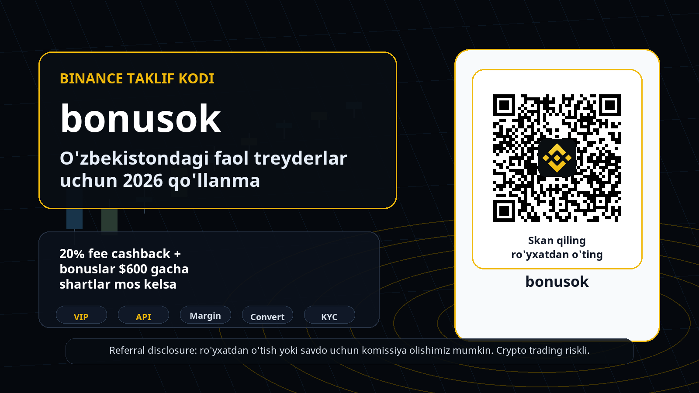
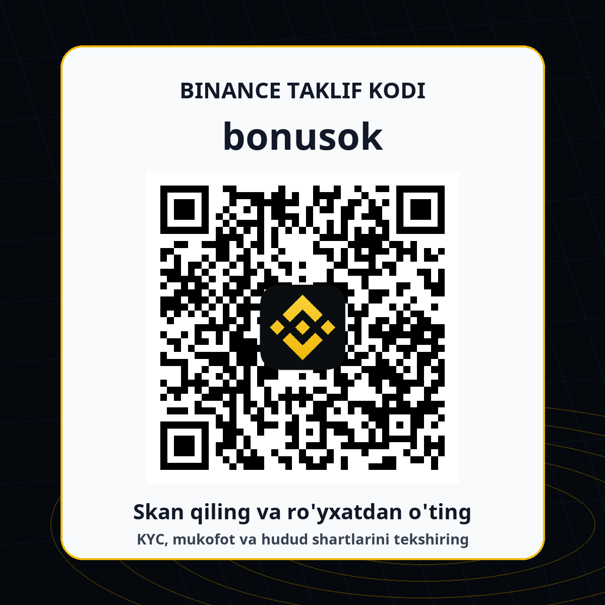

# Binance referral code bonusok: O'zbekistondagi faol treyderlar uchun 2026 qo'llanma

**Tez xulosa:** bu qo'llanma Binance referral code, Binance taklif kodi, promo code va fee cashback qidirayotgan O'zbekiston auditoriyasi uchun yozildi. Kod: **bonusok**. Referral havola: [https://accounts.binance.com/register?ref=bonusok](https://accounts.binance.com/register?ref=bonusok). Taklif odatda 20% fee cashback va bonuslar $600 gacha deb yuritiladi, lekin yakuniy shartlar Binance akkauntingiz, KYC holati, Rewards Hub, hududiy mavjudlik va aksiyaning amaldagi qoidalariga bog'liq. Ro'yxatdan o'tishdan oldin hamma narsani Binance ichida tekshiring.

**Disclosure va risk warning:** ushbu sahifada referral havola bor. Agar siz ro'yxatdan o'tsangiz yoki savdo qilsangiz, biz komissiya olishimiz mumkin. Crypto trading, margin, futures, stock trading, on-chain swap, prediction markets va bot/API strategiyalar yuqori riskli. Narxlar tez o'zgaradi, leverage zararlarni kattalashtiradi, smart contract va likvidlik riski bor. Bu investitsion, moliyaviy yoki huquqiy maslahat emas.

<picture>
  <source media="(max-width: 640px)" srcset="binance-bonusok-uzbek-active-traders-mobile-hero.png">
  
</picture>

## Nega aynan faol treyderlarga qaratilgan material kerak

Ko'p referral sahifalar faqat bitta gapni takrorlaydi: kodni kiriting, bonus oling, savdo qiling. Bunday sahifa ro'yxatdan o'tish berishi mumkin, lekin aktiv treyder va uzoq muddatli trading volume olib kelishi qiyin. O'zbekistonda Binance haqida qidiradigan auditoriya ikki xil: yangi foydalanuvchi kodni qanday qo'llashni bilmoqchi, tajribali treyder esa likvidlik, komissiya, KYC, mahalliy kirish yo'li, API, VIP, margin va mahsulot mavjudligini tekshiradi. Biz ikkinchi guruhga ham javob beradigan sahifa qurdik.

Faol treyder uchun referral code faqat kirish nuqtasi. Muhim savollar boshqacha: komissiya qay darajada kamayadi, order flow qaysi bo'limda qulayroq, leverage yoki margin kerakmi, API mavjudmi, on-chain strategiya bilan CEX hisobini qanday ajratish kerak, va O'zbekiston rezidenti sifatida qaysi mahalliy qoidalarga amal qilish zarur. Shuning uchun bu material oddiy reklama emas, balki **Binance O'zbekiston**, **Binance referral code bonusok**, **Binance taklif kodi**, **fee cashback**, **KYC checklist**, **API trading** va **VIP qualification** kabi qidiruv niyatlarini bitta joyda tartiblaydi.

## O'zbekiston konteksti: avval mahalliy kirish va P2P qoidalarini tekshiring

O'zbekiston auditoriyasi uchun eng muhim blok - mahalliy compliance. Coinpay va Binance hamkorligi haqidagi rasmiy sahifada foydalanuvchilar `coinpay.uz/binance` orqali Binance yechimidan foydalanishi, milliy valyutada bank kartalari va lokal to'lov tizimlari orqali deposit/withdrawal qilish imkoniyati borligi aytilgan. Shu bilan birga, Coinpay sahifasi rezidentlar Binance platformasiga Coinpay bergan havola orqali kirishi va milliy valyutadagi deposit/withdrawal operatsiyalarini bank kartalari hamda milliy payment systems orqali bajarishi kerakligini eslatadi.

Bu nuance referral funnel uchun juda muhim. Agar foydalanuvchi faqat `bonusok` kodiga qarab harakat qilsa, lekin lokal tartibni o'qimasa, konversiya sifati pasayadi: KYC, to'lov, P2P, withdrawal yoki mahsulot mavjudligi bo'yicha muammo chiqishi mumkin. Shu sababli sahifada ro'yxatdan o'tish CTA bor, lekin undan oldin "O'zbekistonda Binancega qanday kirishim kerak?", "P2P bo'yicha lokal ogohlantirish bormi?", "KYC tugallanganmi?", "men ishlatmoqchi bo'lgan mahsulot hududimda ochiqmi?" degan savollar beriladi. Faol treyder uchun bu ehtiyotkorlik conversion killer emas, aksincha trust builder.

## Taklif: bonusok kodi nima beradi va nimani va'da qilmaydi

Biz ishlatayotgan referral constant: **bonusok**. Referral link: [https://accounts.binance.com/register?ref=bonusok](https://accounts.binance.com/register?ref=bonusok). Kampaniya bazamizda Binance uchun headline offer 20% fee cashback va bonuslar $600 gacha sifatida yuritiladi. Buni sahifada aniq, lekin ehtiyotkor yozdik: "up to" va "agar shartlar mos kelsa" iboralari bilan. Sababi Binance mukofotlari, rebate, trading fee rebate, welcome reward, task, voucher yoki account-level eligibility vaqt o'tishi bilan o'zgarishi mumkin. Mukofotning o'zi ko'rinmasa, foydalanuvchi Binance hisobidagi Rewards Hub, referral dashboard va promo terms qismlarini tekshirishi kerak.

Faol treyderlarni jalb qilish uchun "bonus bor" degan gap yetarli emas. Ular uchun 20% fee cashback imkoniyati maker/taker fee, spot volume, futures volume, BNB holding, VIP tier, slippage va strategy turnover bilan birga ko'rilishi kerak. Agar treyder oyiga ko'p marta trade qilsa, fee optimizatsiya real qiymatga ega. Agar u kam savdo qilsa yoki faqat bir marta bonus uchun kirsa, uzoq muddatli retention past bo'ladi. Shuning uchun sahifa "bepul pul" ohangida emas, "komissiya va product access checklist" ohangida yozildi.

## Yangilik 1: Stock Trading volume vaqtincha VIP qualification uchun 3x hisoblanadi

2026-06-18 kuni Binance stock trading volume'ni cheklangan muddatda VIP qualification hisobiga 3x multiplier bilan qo'shishini e'lon qildi. Announcement bo'yicha eligible period 2026-06-18 00:00 UTC dan 2026-07-18 23:59 UTC gacha. Oddiy foydalanuvchilar va VIP 1-2 segmentidagi eligible userlar uchun stock trading volume 30-day spot volume thresholdga 3x qiymatda qo'shiladi; ro'yxatdan o'tish talab qilinmaydi. E'londa 7,000+ U.S.-listed stocks va ETFs, fractional shares from $5, 24/5 trading va zero commission plus minimum platform fee kabi detallar ham bor.

Nega bu referral material uchun kuchli hook? Chunki bu yangilik oddiy "promo code" auditoriyasidan ko'ra ko'proq aktiv treyderlarni qiziqtiradi. VIP tier bo'yicha harakat qiladigan foydalanuvchi fees, limits, priority support, higher volume va advanced insights haqida o'ylaydi. Lekin O'zbekiston sahifasida bu mahsulotni hammaga mavjud deb yozish noto'g'ri bo'lardi: Binance announcementning o'zi "products and services may not be available in your region" deydi. Shuning uchun biz stock tradingni "agar sizning akkauntingizda mavjud bo'lsa, VIP yo'nalishida tekshirishga arziydigan yangilik" sifatida berdik, universal va'da sifatida emas.

## Yangilik 2: Binance Wallet Web3 API - on-chain treyder va developerlar uchun signal

2026-06-17 announcement Binance Wallet Web3 API haqida. Binance bu API'ni developers, institutions va advanced on-chain traders uchun market data, swap quotes, on-chain transaction execution, multi-chain support va non-custodial transaction workflow sifatida tasvirlaydi. Bu yangilik O'zbekiston auditoriyasida ham qimmatli, chunki ko'plab aktiv treyderlar CEX hisobidan tashqari wallet, DEX, on-chain swaps, portfolio tools yoki bot infrastructure bilan ishlaydi. Bunday foydalanuvchi referral code sahifasiga kirsa, u oddiy bonusdan ko'ra infratuzilmani baholaydi.

Web3 API bo'yicha sahifada asosiy fikr: bu qulaylik, lekin xavfsizlik o'rnini bosmaydi. Binance announcementda ham smart contract, volatility, slippage, total loss va legal compliance risklari eslatiladi. Non-custodial degani "risk yo'q" degani emas; foydalanuvchi o'zi imzolayotgan transaction, token approval, network fee, bridge yoki swap route'ni tushunishi kerak. Referral CTA shu joyda tabiiy ko'rinadi: agar foydalanuvchi Binance ekotizimidan Web3 va CEX tomonni birga ko'rib chiqayotgan bo'lsa, `bonusok` kodi orqali akkaunt ochish uning keyingi product exploration jarayoniga mos tushadi.

## Yangilik 3: Prediction Markets API - faqat eligible userlar uchun

Binance Wallet Prediction Markets API 2026-06-08 kuni e'lon qilingan. Announcementda programmatic access, market data, trading/order management, position management, fund transfers, trading applications, quantitative research, market making va analytics use cases ko'rsatilgan. Bu so'zlar aktiv treyder segmenti uchun kuchli: ular signal, data, automation, liquidity va execution haqida o'ylaydi. Shu sababli SEO sahifada "Binance API trading", "trading bots", "quantitative strategies" kabi kalit iboralar tabiiy paydo bo'ladi.

Lekin bu blokda ogohlantirish yanada muhim. Announcement eligibility talablarini sanaydi: identity verification, Prediction Account, SAS authorization va API management permission. Shuningdek, product availability regiondan regionga farq qilishi, prediction market trading riskli ekani va foydalanuvchi o'z jurisdictionidagi qonuniylikni o'zi tekshirishi kerakligi aytilgan. Biz buni referral materialga qo'shdik, chunki sifatsiz traffic "API bor ekan" deb klik qiladi; sifatli traffic esa avval eligibility va region restrictionni tekshiradi. Bizga kerak bo'lgan referral - aynan ikkinchi turdagi foydalanuvchi.

## Yangilik 4: Margin Close Position ichida Convert varianti

2026-06-16 announcement Binance Margin Close Position flow uchun yangi Convert option haqida. Maqsad - pozitsiyani yopishda assetni Convert orqali sotish va settlement currency'ni to'g'ridan-to'g'ri olish imkonini berish. Binance matniga ko'ra, katta miqdordagi orderlarda Convert market orderga nisbatan kamroq slippage bilan yaxshiroq narx berishi mumkin; lekin market order varianti ham qoladi. Feature grayscale release orqali web va appda bosqichma-bosqich ochiladi, demak hamma foydalanuvchi uni darhol ko'rmasligi mumkin.

Bu yangilik aktiv margin foydalanuvchisi uchun amaliy. Margin tradingda pozitsiyani yopish, debt repayment, settlement currency va slippage kabi elementlar real PnLga ta'sir qiladi. Referral sahifada buni "daromad kafolati" sifatida emas, "riskni boshqarish workflow'i yaxshilanishi mumkin" sifatida ko'rsatish kerak. O'zbekistonlik foydalanuvchi margin yoki futures ishlatishdan oldin mahsulot hududida mavjudligini, leverage mosligini, liquidation riskini, interest/debt shartlarini va o'z tajribasini tekshirishi zarur.

## Yangilik 5: Convert endi Buy/Sell ichida ko'rinadi

2026-06-17 announcementda Binance Convert'ni Buy/Sell section ichida ko'rsatish haqida yozilgan. Bu navigation update: eligible users supported countries ichida crypto-to-crypto convert, buy yoki sell flow'ni bir joyda bajarishi mumkin. Bunday kichik UX yangilik referral maqolada mayda ko'rinishi mumkin, lekin yangi foydalanuvchi uchun juda muhim. Agar odam O'zbekistonda lokal to'lov, fiat deposit va keyin crypto-to-crypto conversion qilmoqchi bo'lsa, app ichidagi oqim qanchalik tushunarli bo'lsa, birinchi trade completion shunchalik osonlashadi.

SEO nuqtai nazaridan bu "Binance Convert Uzbekistan", "how to buy and convert crypto on Binance", "Binance Buy/Sell" kabi long-tail savollarga javob beradi. Biz uni aktiv treyderga ham bog'ladik: Convert order book strategiyasi emas, ammo rebalance, fast settlement, debt repayment yoki oddiy portfolio rotation paytida foydali bo'lishi mumkin. Shunday bo'lsa ham, foydalanuvchi price quote, spread, slippage, fee va product termsni transactiondan oldin ko'rishi kerak.

## Yangilik 6: Portfolio Margin va Futures tier update - risk managerlar uchun signal

2026-06-17 announcement 2026-06-19 uchun Portfolio Margin collateral ratio va USD-M perpetual contracts leverage/margin tiers update haqida. Binance matni existing positions ham affected bo'lishi mumkinligini, futures grid leverage/margin tier update sabab expire bo'lishi mumkinligini va foydalanuvchilar oldindan sozlash kerakligini eslatadi. Bu juda muhim, chunki aktiv trader uchun birja yangiliklari faqat listing yoki bonus emas; margin tier, collateral ratio va contract parameter o'zgarishi ham risk exposure'ni o'zgartiradi.

Shu sababli materialda "Binance yangiliklarini kuzatish" bo'limi bor. Referral orqali kelgan sifatli treyder announcement center, risk warning, product terms, fees va local availabilityni kuzatadi. Agar sahifa faqat QR va bonusdan iborat bo'lsa, bunday foydalanuvchi ishonmaydi. Agar sahifa unga "pozitsiyangiz bor bo'lsa, tier update sizni ham ta'sirlantirishi mumkin" desa, bu professionalroq signal beradi. Aynan shunday signal retention va 30/90-day active trader ko'rsatkichlariga yordam beradi.

## O'zbekistonlik foydalanuvchi uchun ro'yxatdan o'tish checklist

1. Avval mahalliy kirish yo'lini tekshiring: Coinpay sahifasidagi `coinpay.uz/binance` yo'nalishi va rasmiy Binance account flow bir-biriga qanday ulanayotganini ko'ring.
2. Referral code `bonusok` yoki referral havola [https://accounts.binance.com/register?ref=bonusok](https://accounts.binance.com/register?ref=bonusok) orqali ochilganini tekshiring.
3. Identity verification/KYC talablarini tugating. Ko'p mukofot, API yoki trading feature KYC bo'lmasa ishlamasligi mumkin.
4. Rewards Hub yoki referral dashboard ichida fee cashback, voucher, bonus task va eligibility shartlarini tekshiring.
5. Deposit va withdrawal uchun lokal payment systems, bank card va milliy valyuta qoidalarini faqat rasmiy manbadan tekshiring.
6. P2P bo'yicha Coinpay ogohlantirishini o'qing. Rezidentlar uchun P2P operatsiyalar qonuniy talablarni buzishi mumkinligi aytilgan.
7. Spot, Margin, Futures, Stock Trading, Web3 Wallet, API va Prediction Markets availability sizning account regioningizda ochiq yoki yo'qligini tekshiring.
8. Birinchi trade oldidan fee, spread, slippage, liquidation risk, order type va tax/reporting majburiyatlarini tushuning.

## Kimlar uchun bu sahifa eng mos

Bu material eng avvalo aktiv spot treyderlar, volume'ni kuzatadigan foydalanuvchilar, Binance VIP yo'nalishiga qiziqadiganlar, API va automation bilan ishlaydigan developerlar, on-chain wallet/DEX flow'ini CEX hisob bilan bog'laydiganlar va margin/futures riskini tushunadiganlar uchun yozildi. Ular qidiruvda "Binance referral code", "Binance invite code", "Binance promo code", "Binance bonusok", "Binance O'zbekiston", "Binance fee cashback", "Binance API" kabi iboralarni ishlatishi mumkin. Sahifa shu qidiruvlarni bir joyga jamlaydi.

Bu sahifa quyidagi foydalanuvchilar uchun mos emas: riskni o'qimasdan leverage ochmoqchi bo'lganlar, bonusni kafolatli daromad deb o'ylaydiganlar, mahalliy qoidalarni chetlab o'tmoqchi bo'lganlar, boshqa odam nomiga account ochmoqchi bo'lganlar, wash trading yoki manipulyativ volume bilan referral/bonus olishga urinadiganlar. Binance va kampaniya qoidalari bunday xatti-harakatlarni rad qilishi mumkin. Bizning maqsadimiz raw signup emas, balki qonuniy, KYCdan o'tgan, riskni tushunadigan va uzoqroq muddat aktiv qoladigan trader.

## Qanday qilib bonusok kodini tekshirish kerak

Eng oddiy yo'l: [https://accounts.binance.com/register?ref=bonusok](https://accounts.binance.com/register?ref=bonusok) havolasi orqali oching yoki QR kodni skan qiling. Registration flow ichida referral code yoki invite code maydonida `bonusok` ko'rinishini tekshiring. Ba'zi flowlarda code avtomatik qo'llanadi, ba'zilarida qo'lda kiritish kerak bo'lishi mumkin. Agar code ko'rinmasa, registrationni yakunlashdan oldin orqaga qayting, cookie/session yoki app/browser yo'nalishini tekshiring, kerak bo'lsa Binance support yoki referral page orqali tasdiqlang.

Account ochilgandan keyin rewards avtomatik ko'rinmasligi mumkin. Bu normal holat bo'lishi mumkin, chunki mukofotlar KYC, deposit, trade, volume, muddat, product availability yoki yangi foydalanuvchi statusiga bog'lanadi. "Up to $600" yoki "20% cashback" iboralarini maksimal potensial sifatida o'qing, yakuniy huquq sifatida emas. Agar Rewards Hub hech narsa ko'rsatmasa, public sahifadan ko'ra account ichidagi rasmiy terms ustuvor.

## Faol treyderni jalb qiladigan asosiy sabablar

Birinchi sabab - Binance hali ham katta likvidlik va keng mahsulot ekotizimi bilan ko'p traderlar uchun default platformalardan biri. Ikkinchi sabab - so'nggi yangiliklar oddiy retaildan tashqari advanced segmentga ham tegadi: Web3 API, Prediction Markets API, VIP multiplier, margin workflow, Convert UX va portfolio/futures tier updates. Uchinchi sabab - O'zbekiston uchun lokal compliance narrative bor: Coinpay hamkorligi, local payment systems, bank card deposit/withdrawal va P2P bo'yicha aniq ogohlantirish.

Referral nuqtai nazaridan bular yaxshi kombinatsiya. Agar sahifa faqat bonusga urg'u bersa, u bonus hunter olib keladi. Agar sahifa fees, VIP, API, risk va lokal rules haqida gapirsa, u ko'proq trading-intent foydalanuvchini olib keladi. Prognozda aynan shu segment muhim: kamroq klik bo'lishi mumkin, lekin KYC, deposit va first trade ehtimoli yuqoriroq bo'ladi.

## Tez-tez so'raladigan savollar

**Binance referral code bonusok O'zbekistonda ishlaydimi?** Referral link ochilishi mumkin, lekin yakuniy eligibility Binance, Coinpay, KYC, region, product availability va amaldagi campaign termsga bog'liq. O'zbekiston rezidentlari mahalliy kirish va payment qoidalarini alohida tekshirishi kerak.

**Bonuslar $600 gacha kafolatlimi?** Yo'q. "Up to" maksimal shartli qiymatni bildiradi. Task, deposit, trade, KYC, region, muddat va account status shartlari bo'lishi mumkin.

**20% fee cashback har bir foydalanuvchiga avtomatik tushadimi?** Uni ham account ichida tekshirish kerak. Referral tracking to'g'ri qo'llangani, user eligibility va amaldagi Binance terms ustuvor.

**P2P ishlatish mumkinmi?** Coinpay rasmiy blogida O'zbekiston rezidentlari P2P operatsiyalari qonuniy talablarni buzishi mumkinligi haqida ogohlantirish bor. Shu sababli P2Pdan oldin rasmiy Coinpay/Binance va lokal qoidalarni tekshiring.

**Futures, margin, stock trading yoki Prediction Markets hamma uchun ochiqmi?** Yo'q. Binance announcementlari doim products and services may not be available in your region deb ogohlantiradi. App/account ichidagi availability va local law muhim.

## Yakuniy tavsiya

Agar siz O'zbekistonda Binance'ni faqat referral code uchun emas, balki faol trading platformasi sifatida ko'rib chiqayotgan bo'lsangiz, `bonusok` kodini fees va product checklist bilan birga baholang. QR yoki havola orqali ro'yxatdan o'tishdan oldin mahalliy Coinpay yo'nalishini, KYC, reward eligibility, product availability, P2P ogohlantirishi, risk tolerance va trading planingizni tekshiring. Yaxshi referral foydalanuvchi - bu shoshilib leverage ochadigan odam emas; u shartlarni o'qiydi, kichik test transaction qiladi, feesni hisoblaydi va riskni boshqaradi.

**CTA:** Binance referral code `bonusok` bilan ro'yxatdan o'tish yoki code qo'llanganini tekshirish uchun: [https://accounts.binance.com/register?ref=bonusok](https://accounts.binance.com/register?ref=bonusok)

## Manbalar va tekshiruv sanasi

Tekshiruv sanasi: 2026-06-20. Binance announcementlari va Coinpay sahifasi o'zgarishi mumkin, shuning uchun account ichidagi final terms ustuvor.

- [Binance Latest News](https://www.binance.com/en/support/announcement/list/49) - Latest Binance News list checked on 2026-06-20.
- [Stock Trading VIP multiplier](https://www.binance.com/en/support/announcement/detail/24d9efcec1024984b94b8526d0e76494) - 2026-06-18 announcement about stock trading volume counting 3x toward VIP spot volume for eligible users.
- [Binance Wallet Web3 API](https://www.binance.com/en/support/announcement/detail/a9f19002d4584183b83892b002d61f96) - 2026-06-17 announcement about Web3 API for developers, institutions and advanced on-chain traders.
- [Prediction Markets API](https://www.binance.com/en/support/announcement/detail/1cfffee40a0d49c182e0b4366ea3f374) - 2026-06-08 announcement about programmatic access, eligibility and regional availability.
- [Margin Convert close position](https://www.binance.com/en/support/announcement/detail/568b96e7109548048ba17f67a231defd) - 2026-06-16 announcement about Convert as an additional close-position method on Binance Margin.
- [Convert on Buy/Sell](https://www.binance.com/en/support/announcement/detail/7ba1755a4fa544ee8d721bf36307b019) - 2026-06-17 announcement about Binance Convert access inside the Buy/Sell flow.
- [Portfolio Margin and Futures tiers](https://www.binance.com/en/support/announcement/detail/d1954a75b8514a2d91b9135a13348df5) - 2026-06-17 announcement for 2026-06-19 margin/collateral tier updates.
- [Coinpay and Binance partnership](https://coinpay.uz/blog/ofitcialnyi-zapusk-partnerstva-coinpay-i-binance/) - Uzbekistan local-access note about coinpay.uz/binance, local payment systems and P2P warning.
