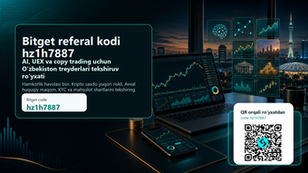
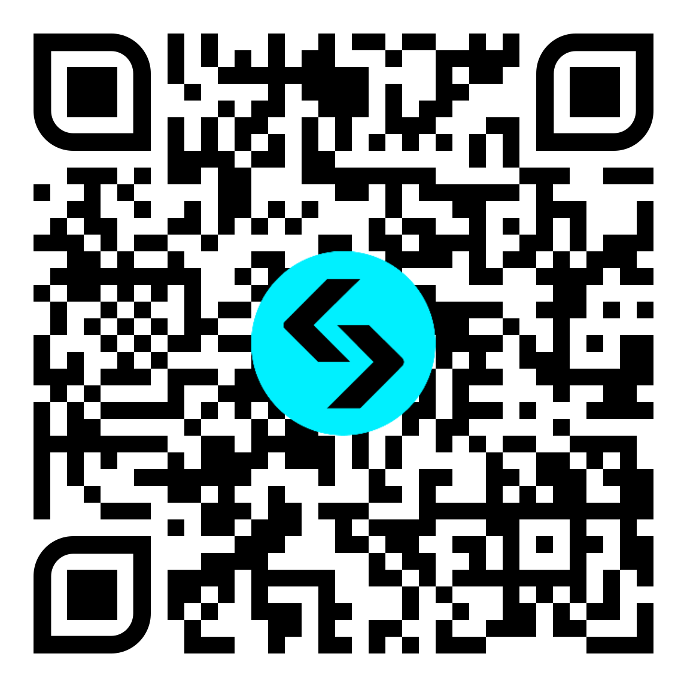

# Bitget referal kodi hz1h7887

**O'zbekiston auditoriyasi uchun Bitget AI, UEX, copy trading va bonus shartlarini tekshirish bo'yicha amaliy qo'llanma.**

[To'liq cover rasmini ochish](bitget-uzbekistan-ai-uex-hz1h7887-cover.png)

**Qisqa xulosa:** Bitget uchun referal kodi — **hz1h7887**. Ro'yxatdan o'tishdan oldin kod ro'yxatdan o'tish oynasida ko'rinayotganini, bonus va cashback shartlari sizga tegishli ekanini, KYC talablari, yurisdiksiya cheklovlari, O'zbekistondagi kripto xizmatlar bo'yicha NAPP qoidalari va tanlangan mahsulotning risklari tushunarli ekanini tekshiring.

Bu sahifa Bitget rasmiy sahifasi emas. Unda hamkorlik havolasi bor; siz ro'yxatdan o'tsangiz yoki savdo qilsangiz, biz referal komissiya olishimiz mumkin. Kripto aktivlar, fyuchers, copy trading, botlar, tokenlashtirilgan aktivlar va AI yordamidagi savdo yuqori riskli. Bonus, cashback yoki bot foyda kafolatlamaydi. Quyidagi material moliyaviy, huquqiy yoki soliq maslahati emas.

  <a href="https://www.bitget.com/en/expressly?channelCode=2avs&languageType=0&vipCode=hz1h7887" rel="sponsored nofollow"><strong>Bitget referal havolasini ochish: hz1h7887</strong></a>

## Nima uchun aynan shu mavzu

O'zbek tilida Bitget haqida qidiradigan foydalanuvchi odatda bitta savol bilan boshlaydi: "Bitget referal kodi nima?", "Bitget taklif kodi bormi?", "Bitget promo kod ishlaydimi?", "hz1h7887 kodi bonus beradimi?". Lekin faol treyder uchun haqiqiy savol bundan kengroq. Kodni bilish oson; qiyin tomoni — ro'yxatdan o'tishdan oldin mahsulot shartlarini tushunish, risk limitini belgilash, copy trading yoki botni ko'r-ko'rona yoqmaslik, AI funksiyasini foyda signali emas, tekshiruv yordamchisi sifatida ishlatish.

2026 yil iyun oyida Bitget atrofidagi eng muhim yangiliklardan biri GetAgent Playbook va AI savdo workflow'lari bo'ldi. Bu yo'nalish treyderga bozorni tahlil qilish, savdo g'oyasini tartibga solish, pozitsiya ochishdan oldin tekshiruv ro'yxatini tuzish va o'z xatolarini qayta ko'rib chiqish imkonini berishi mumkin. Lekin AI hech qachon "foyda kafolati" emas. AI javobi sizning risk qoidangiz, grafik, likvidlik, spred, yangiliklar, funding rate, komissiya va yurisdiksiya shartlari bilan solishtirilgandagina foydali bo'ladi.

Ikkinchi muhim yo'nalish — UEX, ya'ni Bitget o'zini faqat oddiy kripto birjasi emas, balki kengroq multi-asset tajribasi sifatida ko'rsatmoqda. Tokenlashtirilgan aksiyalar, RWA, stock perps, copy trading va botlar faol treyderlar uchun qiziqarli bo'lishi mumkin. Shu bilan birga, bunday mahsulotlar oddiy spot savdodan murakkabroq. Har bir mahsulotning likvidligi, ish vaqti, emitent riski, narx manbasi, leverage, komissiya, soliq va lokal mavjudlik shartlari alohida tekshiriladi.

Uchinchi sabab — O'zbekiston konteksti. O'zbekistonda kripto xizmatlar sohasi tartibga solinadi, maxsus vakolatli organ va litsenziyalangan xizmat ko'rsatuvchilar bo'yicha rasmiy ma'lumotlar bor. Shuning uchun ushbu maqola "darhol savdo qil" degan post emas. Maqsad — foydalanuvchini referal kodi orqali olib kirishdan oldin, unga qanday tekshirishlar kerakligini ko'rsatish. Bunday yondashuv kamroq, lekin sifatliroq referral beradi: KYC qiladigan, shartlarni o'qiydigan, riskni boshqaradigan va uzoqroq vaqt faol qoladigan treyder.

## Ro'yxatdan o'tishdan oldin 7 ta majburiy tekshiruv

1. **Kod ko'rinyaptimi:** Bitget ro'yxatdan o'tish oynasida `hz1h7887` kodi ko'rinishi yoki kiritilishi kerak. Agar kod bo'sh bo'lsa, hisob ochishni yakunlamang.
2. **Bonus sharti:** "up to" yoki "gacha" degan so'zga e'tibor bering. Maksimal bonus hamma foydalanuvchiga avtomatik berilmaydi. Depozit, savdo hajmi, muddat, mahsulot turi va region shartlari bo'lishi mumkin.
3. **Cashback yoki fee rebate:** 20% cashback kabi takliflar doim ham har bir mahsulotga, har bir davlatga va har bir hisob turiga tatbiq etilmaydi. Rasmiy reward sahifasini tekshiring.
4. **KYC va lokal mavjudlik:** O'zbekiston foydalanuvchilari uchun ro'yxatdan o'tish, verifikatsiya, depozit, chiqarish va mahsulotga kirish shartlari alohida bo'lishi mumkin.
5. **NAPP va lokal qoidalar:** O'zbekistonda kripto xizmatlar bo'yicha rasmiy ma'lumotlarni tekshiring. Cheklovni aylanib o'tish, noto'g'ri ma'lumot kiritish yoki VPN bilan o'zini boshqa davlat rezidenti sifatida ko'rsatish xavfli.
6. **Risk hajmi:** Birinchi savdo hajmi bonusni olish istagiga emas, yo'qotishga tayyor bo'lgan o'quv byudjetiga asoslanishi kerak.
7. **Mahsulot farqi:** Spot, fyuchers, copy trading, bot, tokenlashtirilgan aktiv va RWA bir xil risk emas. Har birini alohida o'rganing.

## Bitget referal kodi hz1h7887 qanday ishlatiladi

Eng toza yo'l — referal havolasini ochish va ro'yxatdan o'tish oynasida `hz1h7887` kodi qo'llanganini tekshirish. Ba'zi sahifalarda bu "referral code", "invite code", "promo code" yoki "taklif kodi" kabi yozilishi mumkin. Muhimi — kod aynan `hz1h7887` bo'lishi. Agar siz ro'yxatdan o'tib bo'lganingizdan keyin kod qo'llanmaganini ko'rsangiz, uni keyin qo'shish imkoni bo'lmasligi mumkin.

Kod qo'llangandan keyin ham bonusni avtomatik deb qabul qilmang. Bitget reward sahifasi, bonus markazi yoki rasmiy kampaniya shartlarida sizga tegishli vazifalar ko'rsatiladi. Masalan, ayrim kampaniyalarda minimal depozit, ma'lum savdo hajmi, KYC tugallanishi yoki ma'lum muddat ichida bajariladigan task bo'lishi mumkin. Agar shart sizning savdo rejangizga mos kelmasa, bonus uchun ortiqcha risk qilish shart emas.

Referal kodi foydali kirish nuqtasi bo'lishi mumkin, lekin u savdo strategiyasi emas. Kod sizga potensial bonus, komissiya imtiyozi yoki referral tracking beradi. Strategiya esa alohida: qaysi bozor, qaysi vaqt oralig'i, qaysi risk, qaysi stop, qaysi chiqish rejasi va qaysi maksimal yo'qotish.

## GetAgent Playbook: AI ni signal emas, tekshiruvchi sifatida ishlating

GetAgent Playbook kabi AI yo'nalishlari faol treyder uchun qiziqarli, chunki ular bozor haqidagi ma'lumotni tartiblashga yordam beradi. Lekin AI ga "nima sotib olay?" deb savol berish eng xavfli usul. Yaxshiroq savollar boshqacha bo'ladi: "Bu setup qaysi shartda ishlamay qoladi?", "Likvidlik pasaysa nima qilaman?", "Agar narx qarshi yursa stop qayerda?", "Bu savdo oldingi xatolarimga o'xshaydimi?", "Komissiya va spred foyda/risk nisbatini buzadimi?".

O'zbekiston treyderi uchun AI dan foydalanishning eng foydali shakli — pre-trade checklist. Siz AI ga bozor ssenariysini yozdirasiz, keyin uni o'zingiz tekshirasiz. Masalan, BTC yoki ETH bo'yicha long g'oya bor. AI trend, volatillik, yangilik va risklarni sanab beradi. Siz esa chart, order book, funding, spred, leverage, pozitsiya hajmi va stopni alohida ko'rasiz. Agar AI va real ma'lumot mos kelmasa, savdoni o'tkazib yuborish ham strategiya.

AI yordamidagi savdo jurnal ham foydali bo'lishi mumkin. Har bir savdoda kirish sababi, chiqish sharti, maksimal yo'qotish, natija va hissiy holat yoziladi. Keyin AI dan "men qaysi xatoni takrorlayapman?" deb so'rash mumkin. Bu kopirayterlik yoki marketing uchun emas, intizom uchun ishlaydi.

## UEX, tokenlashtirilgan aktivlar va RWA: qiziqarli, lekin shoshilmang

UEX kontseptsiyasi kripto birja tajribasini kengaytiradi. Tokenlashtirilgan aksiyalar, RWA yoki stock perps kabi mavzular faol treyderni qiziqtiradi, chunki ular kripto bozorini an'anaviy aktivlar bilan bog'laydi. Lekin bu mahsulotlar juda ehtiyotkorlik talab qiladi. Tokenlashtirilgan aksiyani oddiy brokerdagi haqiqiy aksiyaga tenglashtirish mumkin emas. Narx manbasi, likvidlik, hisob-kitob, huquq, cheklov, emitent va region masalalari alohida o'qiladi.

O'zbek auditoriyasi uchun bu ayniqsa muhim. Agar mahsulot AQSh aksiyasi, oltin, ETF, RWA yoki boshqa real dunyo aktivi bilan bog'liq bo'lsa, siz uni qaysi huquqiy shaklda olayotganingizni tushunishingiz kerak. Bu spot kriptomi, derivativmi, tokenlashtirilgan mahsulotmi yoki narxga bog'langan kontraktmi? Bu savolga javob bermasdan savdo qilish, faqat chiroyli nomga ishonish bo'ladi.

UEX mavzusini materialga kiritishimizning sababi — yuqori niyatli trafik. "Bitget UEX", "Bitget tokenized stocks", "Bitget RWA", "Bitget aksiyalar" kabi qidiruvlar oddiy bonus qidiruvchidan ko'ra faolroq treyderni olib kelishi mumkin. Bunday odam faqat kod izlamaydi; u yangi mahsulotni qanday xavfsiz tekshirishni bilmoqchi.

## Copy trading: oson tugma emas

Bitget ko'p foydalanuvchi uchun copy trading bilan tanilgan. Copy trading yangi treyderga tajribali treyderning harakatini kuzatish imkonini beradi. Lekin "kuzatish" va "ko'r-ko'rona nusxa olish" boshqa-boshqa narsa. Agar siz leaderning maksimal drawdownini, leverageini, savdo chastotasini, qaysi coinlarga kirishini, pozitsiyani qancha ushlab turishini va yomon bozorda qanday chiqishini ko'rmasangiz, aslida boshqaning riskini o'z hisobingizga olib kelasiz.

Copy tradingni o'quv vositasi sifatida ishlatish yaxshiroq. Kichik summa ajrating, leader tanlash sababini yozing, har bir pozitsiyada nima bo'lganini kuzating. Agar leader ko'p foyda qilgan bo'lsa, bu yaxshi, lekin eng muhim narsa — u yo'qotganda nima qiladi. Stop bormi? Pozitsiyani o'rtacha pasaytiradimi? Bir nechta aktivga diversifikatsiya qiladimi yoki bitta narrativga haddan tashqari bog'lanadimi?

Copy tradingda ham `hz1h7887` kodi faqat kirish bosqichi. Kod bonus yoki referral tracking uchun. Risk boshqaruvi esa sizning vazifangiz. Hech bir leader sizning oilaviy byudjetingiz, soliq holatingiz, qarzingiz, daromadingiz yoki psixologik holatingizni bilmaydi.

## Botlar: sozlama bo'lmasa, avtomatlashtirish xavfga aylanadi

Trading bot foydali bo'lishi mumkin, lekin faqat aniq qoidalar bo'lsa. Grid bot, DCA bot yoki boshqa avtomatlashtirilgan strategiya bozor sharoitiga bog'liq. Range bozorida ishlagan bot trend bozorida zarar berishi mumkin. DCA tushayotgan aktivda o'rtacha narxni yaxshilashi mumkin, lekin aktiv uzoq vaqt tiklanmasa, kapitalni band qilib qo'yadi.

Bot yoqishdan oldin uch savolga javob bering: maksimal yo'qotish qancha, bot qaysi shartda to'xtaydi, qo'shimcha kapital qo'shiladimi yoki yo'qmi? Agar bu savollarga javob yo'q bo'lsa, bot hali tayyor emas. Bonus shartini bajarish uchun botni katta hajmda yoqish ayniqsa xavfli.

Faol treyder uchun botning eng yaxshi roli — takrorlanuvchi ishni tartibga solish. Masalan, kichik hajmda strategiyani test qilish, jurnal yuritish, natijani haftalik ko'rib chiqish. Bot sizning o'rningizga o'ylamaydi. U faqat qoida bo'yicha ishlaydi. Qoida yomon bo'lsa, avtomatlashtirish zararni tezlashtiradi.

## O'zbekiston foydalanuvchisi uchun lokal risklar

O'zbekistonda kripto xizmatlar bo'yicha rasmiy tartib bor. Shuning uchun har qanday global birja yoki mahsulotni ishlatishdan oldin rasmiy manbalarni tekshirish kerak. NAPP saytidagi xizmat ko'rsatuvchilar ro'yxati, amaldagi normativ talablar, lokal soliq va bank qoidalari o'zgarishi mumkin. Bitget sahifasi ochilgani yoki ilova ishlagani mahsulot siz uchun to'liq ruxsat etilganini anglatmaydi.

Depozit va chiqarish ham alohida risk. Qaysi tarmoqdan yuboryapsiz? Minimal depozit qancha? Noto'g'ri tarmoq tanlansa mablag' yo'qolishi mumkinmi? Bank yoki karta operatsiyasida lokal cheklov bormi? Kripto aktivni boshqa walletga chiqarish uchun KYC talab qilinadimi? Bu savollarga javobni oldindan bilish kerak.

Soliq va hisobot masalasi ham bor. Savdo tarixini, depozit/withdrawal yozuvlarini, bonus va komissiya ma'lumotlarini saqlang. Agar siz faol treyder bo'lsangiz, keyin barcha tranzaksiyani tiklash qiyin bo'ladi. Oddiy spreadsheet ham foyda beradi: sana, aktiv, kirish, chiqish, komissiya, sabab, natija.

## Birinchi hafta uchun amaliy reja

**1-kun:** Bitget referal havolasini oching, `hz1h7887` kodi ko'rinyaptimi tekshiring, lekin darhol katta depozit qilmang. Terms, KYC, reward va regional shartlarni o'qing.

**2-kun:** Spot bozor interfeysini ko'ring. Order turi, limit, market, stop, komissiya va withdrawal qoidalarini tushuning. Agar tushunmasangiz, demo yoki juda kichik hajmdan boshlang.

**3-kun:** GetAgent yoki AI workflow imkoniyatlarini faqat tahlil yordamchisi sifatida sinab ko'ring. AI aytgan g'oyani real chart va risk qoidasi bilan solishtiring.

**4-kun:** Copy trading leaderlarini kuzating. Eng yuqori foydaga emas, drawdown, risk, tarix davomiyligi, pozitsiya hajmi va strategiya barqarorligiga qarang.

**5-kun:** Bot yoki automation haqida o'qing, lekin katta summa bilan ishga tushirmang. Avval strategiya qachon ishlamasligini yozing.

**6-kun:** Agar tokenlashtirilgan aktiv yoki RWA mahsulotini ko'rsangiz, uni oddiy aksiyaga tenglashtirmang. Mahsulot hujjatini, region shartini va likvidlikni o'qing.

**7-kun:** Haftalik jurnal tuzing. Qancha foyda qildim degandan ko'ra, qoidalarga amal qildimmi, qayerda shoshildim, qaysi funksiyani hali ishlatmaslik kerak degan savolga javob bering.

## Depozitdan oldingi savdo sifatini tekshirish

Referral kampaniyada eng ko'p uchraydigan xato — foydalanuvchi ro'yxatdan o'tadi, bonus shartini ko'radi va birinchi haftadayoq o'z rejasidan kattaroq savdo qiladi. Bu yomon referral sifati beradi: odam tez kiradi, tez zarar ko'radi va keyin platformani ham, kodni ham ayblaydi. Bizga kerak bo'lgan auditoriya boshqacha. Biz faol, lekin tartibli treyderni jalb qilmoqchimiz: u shartlarni o'qiydi, depozitni bo'lib kiritadi, har bir mahsulotni alohida sinaydi va savdo hajmini hissiyot bilan emas, qoidalar bilan oshiradi.

Depozitdan oldin uchta limit yozib qo'ying. Birinchisi — o'quv byudjeti. Bu summa yo'qotilsa ham hayotingizga ta'sir qilmasligi kerak. Ikkinchisi — kunlik maksimal zarar. Masalan, bir kunda hisobning kichik foizidan ko'p yo'qotilsa, savdo to'xtaydi. Uchinchisi — mahsulot limiti. Spot, copy trading, bot va fyuchers uchun alohida limit belgilang. Fyuchersni spot bilan bir xil risk deb qabul qilmang.

Shuningdek, Bitget ichidagi har bir CTAni savdo signali deb emas, mahsulot yo'lagi deb ko'ring. Rewards yoki bonus sahifasi sizga vazifa ko'rsatishi mumkin; bu vazifa sizning strategiyangizga mos kelmasa, uni bajarmaslik ham oqilona. Copy trading sahifasi leaderlarni ko'rsatadi; bu darhol hammasini kopiyalash kerak degani emas. AI sahifasi ssenariy beradi; bu order ochish buyrug'i emas. UEX yoki tokenized product sahifasi yangi imkoniyat beradi; bu yurisdiksiya va mahsulot shartlari o'qilmasdan ishlatish mumkin degani emas.

Eng yaxshi referral foydalanuvchi birinchi kunda katta savdo qilgan odam emas. Eng yaxshi foydalanuvchi 30, 60 va 90 kundan keyin ham hisobini nazorat qilayotgan, riskni tushungan, komissiyani hisoblagan va o'z savdo jurnalini yuritayotgan odamdir. Shu sababli `hz1h7887` kodi atrofidagi bu material ham qisqa reklama emas, balki tekshiruv ro'yxati sifatida yozildi.

## Kimlar uchun mos bo'lishi mumkin

Bitget sizga mos bo'lishi mumkin, agar siz referral code va bonus shartlarini ro'yxatdan oldin tekshiradigan, KYC va yurisdiksiya masalasiga jiddiy qaraydigan, copy tradingni o'quv vositasi sifatida ko'radigan, AI javobini mustaqil tekshiradigan va risk limitini yozma belgilaydigan foydalanuvchi bo'lsangiz.

Bitgetni shoshilinch ishlatmaslik kerak, agar siz faqat maksimal bonusni ko'rib, shartlarni o'qimasangiz, leverage nima ekanini tushunmasangiz, copy trading foyda kafolatlaydi deb o'ylasangiz, VPN yoki noto'g'ri davlat ma'lumoti bilan cheklovni aylanib o'tmoqchi bo'lsangiz, yoki yo'qotishga tayyor bo'lmagan mablag' bilan savdo qilmoqchi bo'lsangiz.

## Tez-tez so'raladigan savollar

### Bitget referal kodi nima?

Bu materialda ishlatilayotgan Bitget referal kodi — **hz1h7887**. Ro'yxatdan o'tish oynasida aynan shu kod ko'rinishi kerak.

### Bitget taklif kodi va promo kod bir xilmi?

Ko'p sahifalarda referral code, invite code, promo code yoki taklif kodi bir xil vazifani bajarishi mumkin. Muhimi, sizning ro'yxatdan o'tish oynangizda `hz1h7887` ko'rinishi.

### Bonus kafolatlanganmi?

Yo'q. Bonus va cashback shartli. KYC, depozit, savdo hajmi, muddat, region va mahsulot turi bo'yicha cheklovlar bo'lishi mumkin.

### O'zbekistondan Bitget ishlatish mumkinmi?

Bu sahifa huquqiy ruxsatni kafolatlamaydi. O'zbekiston foydalanuvchisi NAPP va boshqa rasmiy manbalarni, Bitget terms va mahsulot mavjudligini tekshirishi kerak.

### AI savdo foyda beradimi?

AI tahlilni tartibga solishi mumkin, lekin foyda kafolatlamaydi. AI javobini chart, likvidlik, risk, komissiya va o'z strategiyangiz bilan tekshiring.

### QR kodi qayerga olib boradi?

QR kodi Bitget hamkorlik ro'yxatdan o'tish yo'liga olib boradi. QR orqali o'tgandan keyin ham `hz1h7887` kodi va shartlarni ekranda tekshiring.

## Rasmiy tekshirish manbalari

- [Bitget GetAgent Playbook va AI trading workflows](https://www.bitget.com/blog/articles/bitget-getagent-playbook-ai-trading-workflows)
- [Bitget GetAgent Playbook support maqolasi](https://www.bitget.com/support/articles/12560603885951)
- [Bitget tokenized stocks, stock perps va fees guide](https://www.bitget.com/academy/bitget-stock-trading-guide-tokenized-stocks-stock-perps-fees-2026)
- [Bitget RWA market liquidity report with Block Scholes](https://www.bitget.com/blog/articles/bitget-rwa-market-liquidity-report-block-scholes)
- [Bitget Proof of Reserves](https://www.bitget.com/proof-of-reserves)
- [Uzbekistan NAPP rasmiy sayti](https://napp.uz/en)
- [NAPP service providers sahifasi](https://napp.uz/en/pages/service-providers)

## Yakuniy CTA

Avval shartlarni tekshiring, keyin ro'yxatdan o'ting. Agar kod ekranda ko'rinmasa, ro'yxatdan o'tishni yakunlamang.

  <a href="https://www.bitget.com/en/expressly?channelCode=2avs&languageType=0&vipCode=hz1h7887" rel="sponsored nofollow"><strong>Bitget referal kodi hz1h7887 bilan ro'yxatdan o'tish</strong></a>

**Risk eslatmasi:** kripto savdo yuqori riskli. Fyuchers, leverage, copy trading, bot va tokenlashtirilgan aktivlar katta yo'qotishga olib kelishi mumkin. Faqat tushungan mahsulotingizdan foydalaning va lokal qoidalarni tekshiring.
