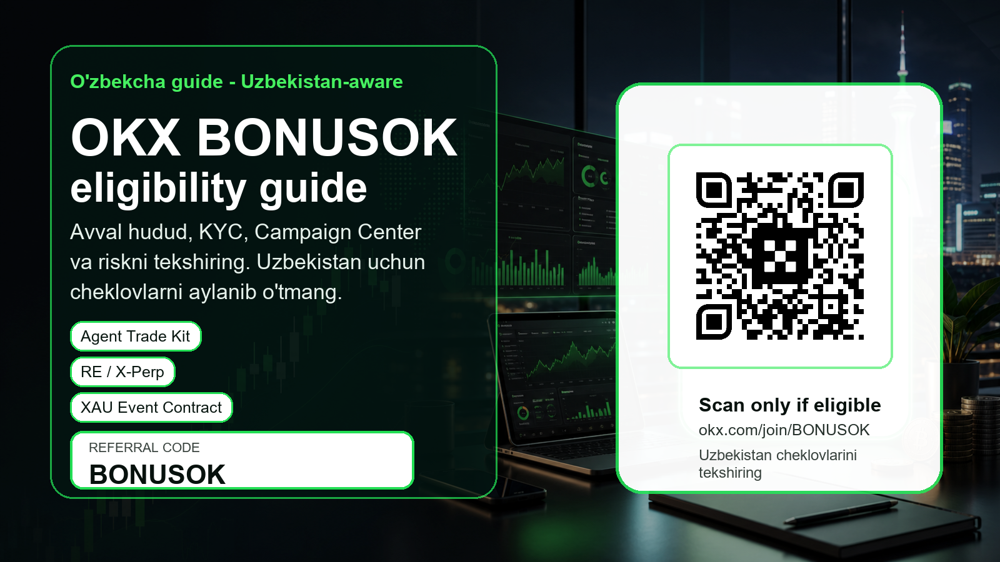

# OKX BONUSOK referal kodi: O'zbekiston uchun eligibility-first qo'llanma

Referral disclosure: bu sahifada sponsored referral link bor. Crypto va derivatives savdosi xatarli. Hudud, KYC, eligibility va rasmiy shartlarni tekshirmasdan depozit yoki savdo qilmang.

Referral link: https://www.okx.com/join/BONUSOK

## Tez xulosa: BONUSOK kodini qachon tekshirish kerak

OKX referral code BONUSOK bo'yicha ushbu o'zbekcha qo'llanma O'zbekiston auditoriyasi uchun yozildi, lekin uning birinchi vazifasi odamni shoshirib ro'yxatdan o'tkazish emas. Eng muhim nuqta shuki: OKX rasmiy risk disclosure hujjatida Uzbekistan restricted location sifatida ko'rsatilgan. Demak, O'zbekistonda yashayotgan yoki OKX tomonidan cheklangan hududga kiradigan foydalanuvchi ro'yxatdan o'tmasligi, depozit qilmasligi va savdo qilmasligi kerak. Bu sahifa cheklovni aylanib o'tish, VPN ishlatish yoki noto'g'ri KYC ko'rsatish uchun emas. Bu sahifa OKX referral code, invite code, promo code, bonus code, Campaign Center va yangi mahsulotlar haqida qidirayotgan o'zbek tilidagi foydalanuvchiga to'g'ri tekshiruv tartibini berish uchun tayyorlandi.
Agar siz OKX ruxsat bergan hududda yashasangiz, rasmiy KYCdan o'ta olsangiz va hisobingizda tegishli mahsulotlar ko'rinsa, BONUSOK kodi faqat shundan keyin ma'noga ega bo'ladi. Kod yoki QR orqali kirishdan oldin domen okx.com ekanini tekshiring, ro'yxatdan o'tish oynasida referral code maydonida BONUSOK ko'rinishini tasdiqlang, Campaign Center yoki Rewards sahifasida haqiqiy vazifalar bor-yo'qligini o'qing. Bonus, sirli sovrin yoki trade-to-earn shartlari sizning hududingiz, KYC darajangiz, depozit usulingiz, savdo hajmingiz va mahsulot ruxsatlaringizga bog'liq bo'lishi mumkin.
Bu maqola active traderga mo'ljallangan. Ya'ni oddiy reklama matni emas, balki spot listing, perpetual futures, XAU Event Contract, Agent Trade Kit, Web3 Wallet, API xavfsizligi, order book, funding rate, liquidation, fee va soliq yozuvlari kabi amaliy savollarni bir joyga yig'adi. Bizning maqsadimiz ko'p ro'yxatdan o'tish emas, balki uzoqroq qoladigan, shartlarni tushunadigan va xavfni boshqara oladigan referral traderlarni jalb qilish.

## O'zbekiston uchun eng muhim eligibility qoidasi

O'zbekiston bo'yicha eng katta SEO savol odatda 'OKX O'zbekistonda ishlaydimi?', 'OKX referral code Uzbekistan', 'OKX BONUSOK', 'OKX promo code' kabi yoziladi. Bu savolga javob berishda ehtiyot bo'lish zarur. Rasmiy OKX risk and compliance disclosure Uzbekistan hududini restricted locations ro'yxatida ko'rsatadi. Shuning uchun O'zbekiston rezidenti bo'lgan foydalanuvchi global OKX hisobini ochish yoki savdo qilishdan oldin rasmiy cheklovlarni to'liq tekshirishi kerak; agar cheklov amal qilsa, foydalanmasligi kerak.
O'zbekistonning rasmiy tartibida kripto xizmat ko'rsatuvchi provayderlar Milliy istiqbolli loyihalar agentligi tomonidan litsenziyalanadi. Rasmiy NAPP sahifasida crypto-exchange, crypto-store, crypto-depository va mining-pool kabi xizmat turlari alohida ko'rsatilgan. Bu nima degani? O'zbekiston ichida yashovchi foydalanuvchi uchun faqat global reklama yoki bonus matni yetarli emas; mahalliy litsenziya, mahalliy qonun, AML/CFT talablari, shaxsiy ma'lumotlar va reklama qoidalarini ham tekshirish kerak.
Bu matn shuning uchun ikki auditoriyaga xizmat qiladi. Birinchisi, O'zbekiston ichida yashab, avvalo cheklovni bilishi kerak bo'lgan foydalanuvchi. Ular uchun asosiy foyda - ro'yxatdan o'tmaslik kerak bo'lsa, buni vaqtida tushunish. Ikkinchisi, o'zbek tilida o'qiydigan, lekin OKX ruxsat bergan yurisdiksiyada yashaydigan yoki ishlaydigan eligible foydalanuvchi. Ular uchun BONUSOK kodi, Campaign Center, AI vositalar va futures risk checklist foydali bo'lishi mumkin.

## Nega active trader uchun aynan so'nggi OKX yangiliklarini oldik

2026 yil iyun oyida OKX yangiliklari orasida active trader e'tiborini tortadigan bir nechta mavzu bor: RE spot savdosi va RE bilan bog'liq trade-to-earn kampaniyasi, REUSD X-Perp, GRAM va boshqa expiry perpetuals, stock-style perpetuals, XAU Gold Event Contract, Agent Trade Kit, Flash Earn mahsulotlari va OKUSD collateral yangiliklari. Bular oddiy yangi tugmalar emas. Ular traderdan order book, spread, leverage, settlement, campaign rule, API permission va region availabilityni birgalikda ko'rishni talab qiladi.
Referral materialda bu yangiliklarni ishlatishning sababi oddiy: active trader bonusdan ko'ra ko'proq instrument, likvidlik, tezkor yangilik, automation va risk nazoratiga qaraydi. Agar sahifa faqat 'BONUSOK kodini kiriting' desa, u qisqa muddatli klik olishi mumkin, lekin tajribali traderni ushlab qolmaydi. Agar sahifa 'qaysi mahsulotlar yangi, qaysi joyda xatar bor, eligible bo'lmasangiz nima qilmaslik kerak' desa, u qidiruvdan kelgan odamga real qiymat beradi.
RE listing va REUSD X-Perp kabi yangiliklar yangi token volatilitesini ko'rsatadi. XAU Event Contract esa oltin narxi, makro yangiliklar va event-style settlement tushunchasini olib kiradi. Agent Trade Kit esa AI trading assistant, market data, execution va API permission xavflarini muhokama qilishga imkon beradi. Shu kombinatsiya OKX referral code qidiruvini professionalroq pre-trade checklistga aylantiradi.

## BONUSOK kodini tekshirish tartibi

Agar siz OKX tomonidan ruxsat berilgan hududda bo'lsangiz, birinchi qadam referral link yoki QRni ochishdan oldin manbani tekshirish. URL okx.com domeniga olib borishi kerak. Qisqa link, notanish Telegram bot, DM orqali yuborilgan rasm, screen-only QR yoki 'support agent' ro'yxatdan o'tkazishi xavfli. Bu sahifada ishlatilgan QR lokal dekod qilindi va https://www.okx.com/join/BONUSOK manziliga olib borishi tekshirildi.
Ikkinchi qadam - ro'yxatdan o'tish oynasida referral code, invite code yoki promo code maydonida BONUSOK ko'rinishini tekshirish. Ba'zi platformalarda kod keyin qo'shilmasligi mumkin. Shuning uchun depositdan oldin ko'rinmayotgan kodni hal qilish kerak. Agar Campaign Centerda bonus, task yoki sirli sovrin ko'rinmasa, 'baribir keyin chiqadi' deb savdo hajmini oshirish yaxshi qaror emas.
Uchinchi qadam - Campaign Center, Rewards, My Rewards yoki aksiyalar bo'limini o'qish. Maksimal bonus qiymati doimo expected value emas. Masalan, 'up to' iborasi hamma foydalanuvchiga maksimal mukofot beriladi degani emas. KYC, yangi foydalanuvchi statusi, depozit minimal miqdori, savdo hajmi, instrument turi, muddat, taqiqlangan strategiyalar va hudud cheklovlari mavjud bo'lishi mumkin.

## Agent Trade Kit: AI qiziqarli, lekin live orderdan oldin sekin yurish kerak

OKX Agent Trade Kit AI agentlarga bozor ma'lumotlari, savdo bajarish, strategiya parametrlarini boshqarish, Earn bilan ishlash va real-time market analysis kabi vazifalarda yordam berishi mumkin. Bu active trader uchun qiziq: AI yordamchisi orderni tayyorlashi, bozorni kuzatishi, pozitsiya holatini tahlil qilishi mumkin. Lekin rasmiy FAQ ham foyda kafolatlanmasligini va risk borligini eslatadi.
Shuning uchun referral sahifada Agent Trade Kitni bonusdan keyingi asosiy hook sifatida ishlatdik, ammo ehtiyot ohangida. AI live trading uchun emas, avval read-only, demo yoki kichik test rejimida ko'rilishi kerak. API key yaratganda withdrawal permission yoqilmasin, IP whitelist, permission scope, sub-account, revoke plan va log review tayyor bo'lsin. AI agent noto'g'ri prompt, noto'g'ri market data, latency yoki haddan tashqari tez execution tufayli zarar keltirishi mumkin.
O'zbek tilida bu mavzu hali keng yoritilmagan. Shuning uchun 'OKX AI', 'OKX Agent Trade Kit', 'AI trading assistant', 'OKX API trading' kabi GEO qidiruvlar uchun foydali bo'lim qo'shildi. Maqsad odamni AIga ishontirish emas, balki u AI tradingni ko'rayotgan bo'lsa, eng muhim xavfsizlik chegaralarini oldindan bilishi.

## Futures, REUSD X-Perp va XAU Event Contract bo'yicha risk checklist

Perpetual futures va event contractlar active trader uchun jozibali, chunki ular tez narx harakati, leverage, funding va qisqa muddatli strategiyalar bilan bog'liq. Lekin aynan shu sababli ular referral kampaniyadagi eng xavfli qismdir. Eligibility noma'lum bo'lsa, mahsulot ko'rinmasa yoki terms tushunilmasa, futuresga o'tmaslik kerak.
REUSD X-Perp yoki boshqa expiry/perpetual instrumentni ko'rayotgan trader avval mark price, index price, funding rate, leverage cap, maintenance margin, liquidation price, order type, reduce-only, cross va isolated margin farqini tushunishi kerak. Yangi listing kunida spread keng bo'lishi, order book yupqa bo'lishi va market order slippage katta bo'lishi mumkin. Bonus uchun savdo hajmini majburan oshirish professional yondashuv emas.
XAU Event Contract alohida e'tibor talab qiladi. Oltin narxi makro yangiliklar, dollar indeksi, foiz stavkalari, geopolitika va likvidlik bilan harakatlanadi. Event contract spot oltin saqlash emas; u settlement qoidalari, strike, expiry va payout condition bilan ishlaydi. Shuning uchun bu mahsulotni maqolada 'yangi imkoniyat' sifatida emas, 'faqat qoidani o'qigan va eligible bo'lgan trader ko'rib chiqishi mumkin bo'lgan murakkab instrument' sifatida berdik.

## Web3 Wallet va self-custody: referraldan ham muhim xavfsizlik

OKX ekotizimi faqat markazlashtirilgan exchange emas, Web3 Wallet, DEX, bridge, dApp va on-chain imkoniyatlarga ham ega. Bu ko'p foydalanuvchilar uchun qiziq, chunki ular exchange hisobidan tashqari DeFi va wallet tajribasini ko'rishni xohlaydi. Lekin self-custodyda asosiy xato - seed phrase, malicious signature, fake airdrop yoki noto'g'ri bridge.
Referral code BONUSOK wallet xavfsizligini almashtirmaydi. Agar foydalanuvchi Web3 Wallet ishlatsa, u private key kimda ekanini, seed phrase qayerda saqlanishini, approvalni qanday bekor qilishni, qaysi dApp rasmiy ekanini va bridge xatosi qaytarilmasligi mumkinligini tushunishi kerak. Bu bo'lim uzoq muddatli retention uchun muhim: xavfsizlikni tushungan foydalanuvchi bir kunlik bonus ovchisidan ko'ra ancha qimmat referral bo'lishi mumkin.
O'zbekiston auditoriyasi uchun bu ham compliance bilan bog'liq. On-chain aktivlar ham riskli, narx o'zgaruvchan, scam ko'p, mahalliy soliq va hisobot masalalari bo'lishi mumkin. Shuning uchun maqola Web3ni reklama qilmaydi, balki walletni ishlatishdan oldingi minimal savollar ro'yxatini beradi.

## SEO/GEO uchun qaysi kalit so'zlarni tabiiy joylashtirdik

Sahifa ichida 'OKX referral code BONUSOK', 'OKX invite code', 'OKX promo code', 'OKX bonus code', 'OKX bonus Uzbekistan', 'OKX O'zbekiston', 'OKX referal kodi', 'OKX Campaign Center', 'OKX Agent Trade Kit', 'OKX futures risk', 'OKX Web3 Wallet' kabi qidiruv niyatlari tabiiy tarzda joylashtirildi. Bu kalit so'zlar ro'yxat sifatida tiqishtirilmadi; har biri foydalanuvchining aniq savoliga bog'landi.
Masalan, 'OKX referal kodi' qidirgan odamga kod va link yetarli emas; u eligibility, KYC, Campaign Center va hudud cheklovini bilishi kerak. 'OKX futures' qidirgan odamga esa liquidation, funding rate va leverage haqida ogohlantirish kerak. 'OKX AI' qidirgan odam Agent Trade Kitni ko'rishi mumkin, lekin API key xavfsizligini ham bilishi kerak.
GEO tomonda 'O'zbekiston', 'Uzbekistan', 'o'zbekcha guide', 'NAPP', 'restricted location', 'eligible Uzbek-speaking users' kabi iboralar ishlatildi. Bu sahifaning maqsadi O'zbekistondagi taqiqlangan foydalanuvchini aylanma yo'lga undash emas, balki qidiruvdan kelgan auditoriyani to'g'ri qarorga olib borish.

## Uch xil foydalanuvchi ssenariysi: sahifa kimga nima deydi

Birinchi ssenariy - foydalanuvchi O'zbekistonda yashaydi, OKX disclosureda esa Uzbekistan restricted location sifatida ko'rsatilganini ko'radi. Bu holatda sahifaning javobi juda oddiy: referral kodni ishlatmang, hisob ochmang, depozit qilmang, futures yoki wallet mahsulotlarini sinamang. Bunday odam uchun maqolaning foydasi conversion emas, balki noto'g'ri harakatni to'xtatishdir. Bu ham SEO/GEO qiymat, chunki qidiruvdan kelgan odam aniq va halol javob oladi.
Ikkinchi ssenariy - foydalanuvchi O'zbekistondan emas, lekin o'zbek tilida o'qiydi: masalan, boshqa davlatda qonuniy yashaydi, KYC hujjatlari shu yurisdiksiyaga mos, OKX unga xizmat ko'rsatadi va app ichida mahsulotlar ko'rinadi. Bunday foydalanuvchi uchun BONUSOK kodi ma'noga ega bo'lishi mumkin. U avval referral maydonini, Campaign Center shartlarini, bonus eligibilityni, deposit usulini va risk warningni tekshiradi. Faqat shundan keyin QR yoki rasmiy referral link orqali davom etadi.
Uchinchi ssenariy - active trader hali OKXdan foydalanishni xohlamaydi, lekin yangi mahsulotlarni kuzatmoqda. U RE listing, REUSD X-Perp, XAU Event Contract yoki Agent Trade Kitni bozor signali sifatida o'qishi mumkin. Bunday odam ham referral auditoriyasining bir qismi, chunki u bugun ro'yxatdan o'tmasa ham, foydali sahifani saqlab qo'yadi, qayta o'qiydi yoki ijtimoiy tarmoqda ulashadi. Shuning uchun maqola faqat 'sign up now' emas, balki yangiliklar, risk va workflowni tushuntiradi.
Bu uch ssenariy SEO matnni kuchaytiradi, chunki sahifa turli niyatlarga javob beradi: 'OKX O'zbekistonda ishlaydimi', 'OKX referral code BONUSOK', 'OKX promo code', 'OKX futures risk', 'OKX AI trading', 'OKX Web3 Wallet'. Eng muhimi, har bir ssenariyda qaror qoidasi aniq: agar ruxsat bo'lmasa - foydalanmaslik; agar ruxsat bo'lsa - shartlarni o'qib, kichik testdan boshlash; agar faqat o'rganayotgan bo'lsa - mahsulotni tushunish, lekin FOMO bilan depozit qilmaslik.

## Birinchi 30 kun uchun active trader workflow

Agar foydalanuvchi eligible bo'lsa va OKXdan foydalanishga qaror qilsa, birinchi kun hisob xavfsizligi bilan boshlanishi kerak: 2FA, anti-phishing code, login device, withdrawal whitelist, kuchli parol va recovery plan. Ikkinchi qadam KYC va region permission. Uchinchisi - kichik test deposit. To'rtinchisi - kichik spot order va tarix eksportini tekshirish. Faqat shundan keyin campaign yoki futures haqida o'ylash mumkin.
Birinchi haftada trader o'ziga daily loss limit, weekly loss limit, max leverage, position size, no-revenge-trading qoidasi, news-time qoidasi va stop-loss intizomini yozib qo'yishi kerak. Bonus task chiqsa ham, bu qoidalarni buzmaslik kerak. Referral bonus professional risk managementni almashtirmaydi.
Birinchi 30 kunda asosiy savol profit emas, jarayon bo'lishi kerak. Fee cost, slippage, funding fee, missed stop, emotional trade, AI suggestion error, wallet approval mistake, deposit/withdrawal delay, tax record completeness kabi metrikalar yozib boriladi. Agar region, withdrawal, KYC yoki mahsulot ruxsati bo'yicha noaniqlik qolsa, savdoni kengaytirmaslik kerak.

## Yakuniy qaror

Ushbu materialda OKX BONUSOKni Uzbekistan auditoriyasiga agressiv reklama sifatida emas, compliance-first va active-trader-first qo'llanma sifatida berdik. Sababi aniq: OKX rasmiy risk disclosure hujjatida Uzbekistan restricted location sifatida ko'rsatilgan. Buni yashirish qisqa muddatli klik berishi mumkin, lekin uzoq muddatli SEO, brend ishonchi va referral sifati uchun noto'g'ri bo'ladi.
Shu bilan birga, o'zbek tilida OKX referral code, invite code, promo code, Campaign Center, AI trading, futures va Web3 Wallet haqida foydali, uzun va indekslanadigan material kam. Eligible Uzbek-speaking foydalanuvchilar uchun bu sahifa BONUSOK kodini tekshirish, bonus shartlarini o'qish, so'nggi OKX yangiliklarini tushunish va xatarni boshqarish uchun kirish nuqtasi bo'lishi mumkin.
Agar siz O'zbekistonda yashasangiz yoki OKX sizni restricted location sifatida ko'rsatsa, ro'yxatdan o'tmang, depozit qilmang va savdo qilmang. Agar siz OKX ruxsat bergan hududda bo'lsangiz, rasmiy domen, KYC, Campaign Center, product permission, risk warning va soliq yozuvlarini tekshirgandan keyingina BONUSOK kodini ko'rib chiqing.

## Rasmiy manbalar

- OKX latest announcements: https://www.okx.com/help/section/announcements-latest-announcements
- OKX latest events: https://www.okx.com/help/section/latest-events
- OKX Agent Trade Kit FAQ: https://www.okx.com/help/agent-trade-kit-faq
- OKX XAU Event Contract launch: https://www.okx.com/help/okx-event-contract-xau-launches
- OKX risk and compliance disclosure: https://www.okx.com/help/risk-compliance-disclosure
- Uzbekistan NAPP service providers: https://napp.uz/en/pages/service-providers