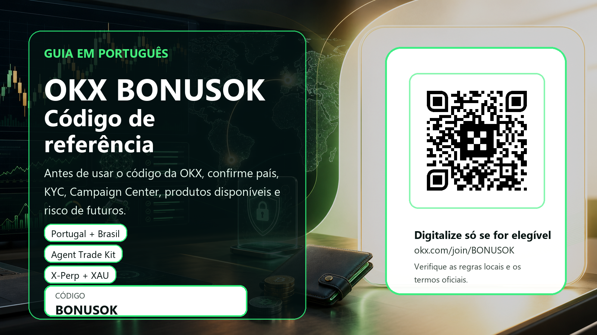

# OKX BONUSOK: código de referência OKX para Portugal e Brasil

Divulgação: esta página contém um link de indicação patrocinado. Criptoativos, futuros, contratos de evento, negociação assistida por IA e carteiras Web3 envolvem risco elevado. Verifique sempre elegibilidade, KYC, regras locais e termos oficiais.

Referral link: https://www.okx.com/join/BONUSOK

## Resumo rápido: para que serve o código de referência OKX BONUSOK?

Este guia em português foi criado para quem pesquisa por código de referência OKX, código de convite OKX, código promocional OKX, código de indicação OKX, OKX referral code, OKX BONUSOK, OKX Portugal ou OKX Brasil. A promessa aqui não é que todo leitor receba automaticamente um prémio ou que todos os produtos estejam disponíveis em todos os países. A proposta é mais útil para um trader ativo: mostrar como verificar elegibilidade, KYC, Campaign Center, riscos de futuros, ferramentas de IA, Web3 Wallet e novidades recentes da OKX antes de clicar em qualquer link de cadastro.
Divulgação de referral: esta página contém um link de indicação patrocinado. Se você usar o código BONUSOK ou o link oficial desta página, o proprietário do site pode receber comissão, cashback de parceiro ou outra remuneração. Isso não muda o risco de mercado e não torna a OKX adequada para todas as pessoas. Criptoativos, futuros, contratos de evento, negociação assistida por IA, bots, margem e carteiras Web3 podem causar perdas relevantes. Nunca deposite dinheiro apenas porque viu a expressão up to, bónus, recompensa ou promoção.
O link de referência usado neste material é https://www.okx.com/join/BONUSOK. O QR code incluído nas imagens foi inserido localmente depois da geração visual, e não foi desenhado por IA. O arquivo QR original e os crops finais do banner e do cartão compacto foram decodificados localmente para confirmar que apontam para o mesmo URL. Esta verificação é importante porque um QR bonito, mas errado, é pior do que nenhum QR: ele pode levar a uma página falsa, a um tracking incorreto ou a uma experiência que não registra o código de indicação.

## Portugal e Brasil: disponibilidade vem antes de qualquer bónus

Portugal e Brasil falam português, mas não são o mesmo mercado regulatório. Em Portugal, a referência natural para criptoativos é o enquadramento europeu MiCA, que regula emissores, prestadores de serviços de criptoativos e comunicações ao mercado dentro da União Europeia. Para um utilizador português, a pergunta certa antes do referral não é só 'qual é o código da OKX?', mas também se o produto que aparece na página global da corretora está disponível na versão europeia, no país de residência e no perfil KYC usado.
No Brasil, a discussão regulatória passa pela Lei 14.478/2022 e por regras locais sobre prestadores de serviços de ativos virtuais. Além disso, a própria divulgação de risco da OKX lista restrições específicas que podem afetar o Brasil em produtos como derivados e P2P. Por isso, este material evita prometer que futuros, P2P, event contracts, bots ou qualquer campanha estarão disponíveis para todos os utilizadores brasileiros. A orientação é simples: abra apenas páginas oficiais, confira a sua região dentro da conta, leia os termos vigentes e não tente contornar restrições com VPN, residência falsa ou KYC incorreto.
Essa cautela não enfraquece o material; ela aumenta a qualidade do tráfego. Um referral bom não é aquele que atrai qualquer clique. É aquele que atrai pessoas que entendem a diferença entre spot, futuros, margem, Web3 e campanhas de recompensa; pessoas que sabem verificar se podem usar o produto legalmente; e pessoas que podem se tornar traders ativos de longo prazo sem transformar uma campanha de bónus em uma aposta impulsiva.

## O que há de novo na OKX que pode interessar traders ativos

A página oficial de New listings da OKX mostra uma sequência forte de anúncios em junho de 2026. Entre 17 e 19 de junho, aparecem REUSD Expiry Perps, OUSD Expiry Perp, futuros perpétuos ligados a equities como SMH, EWZ, RIVN, DKNG e RDDT, spot RE/USDⓈ, RE em spot com conversão de pre-market futures para perpetual futures padrão, GRAMUSD Expiry Perps, perpetual futures para O, pre-market perpetual futures para RE, GRAM spot, migração de TON concluída e ONDOUSD e BEATUSD Expiry Perps. Para um trader ativo, isso sinaliza variedade de instrumentos, mas também exige disciplina: listagem nova costuma ter spreads maiores, funding instável, volatilidade de abertura e risco de liquidez.
A OKX também destaca o Agent Trade Kit, uma ferramenta publicada em abril e atualizada em maio de 2026. A documentação oficial descreve um toolkit que permite a clientes de IA conectar-se à plataforma OKX para acessar dados de mercado em tempo real e executar ordens. Entre as capacidades listadas estão execução em spot, futuros, margem e opções, configuração de estratégias como grid e DCA, gestão de produtos Earn e análise em tempo real de K-lines, funding rates, profundidade do livro de ordens, posições e PnL. Esse é um gancho forte para traders técnicos, programadores, utilizadores de MCP e pessoas que comparam exchanges pela profundidade das ferramentas, não só pelo bónus.
Outro ponto recente é o XAU Gold Event Contract, lançado em 16 de junho de 2026. Segundo a OKX, o contrato usa o índice XAU-USDT como referência de liquidação e oferece instrumentos como XAU Daily Up/Down e XAU Daily Price Above. Para uma página de referral, isso é interessante porque mostra que a OKX está ampliando produtos ligados a eventos e underlyings fora do universo cripto puro. Ao mesmo tempo, event contracts não são um jogo simples: o utilizador precisa entender liquidação, horários, índices, dias sem negociação, encerramentos não programados e a possibilidade de liquidação manual em cenários excepcionais.

## Como usar BONUSOK sem cair na armadilha do bónus pelo bónus

O primeiro passo é confirmar o domínio. Use apenas okx.com ou links oficiais que redirecionem claramente para a OKX. Se você digitalizar o QR desta página, ele deve levar a https://www.okx.com/join/BONUSOK. Evite grupos que prometem suporte privado, KYC garantido, desbloqueio de país ou bónus máximo. Uma campanha legítima não exige que você entregue seed phrase, código 2FA, acesso remoto ao computador ou documentos fora do fluxo oficial da exchange.
O segundo passo é verificar se o código aparece durante o cadastro. Dependendo da interface, você pode ver referral code, invite code, código de convite, código promocional ou código de indicação. Se BONUSOK não aparecer, se a página de recompensas não listar tarefas, ou se os termos da campanha não forem claros, não deposite apenas na esperança de que o sistema ajuste depois. Campanhas podem variar por país, data, KYC, tipo de conta, valor mínimo de depósito, volume de trading, produto elegível e histórico do utilizador.
O terceiro passo é separar o incentivo comercial da sua estratégia. Se você já pretendia testar OKX e está elegível, um código de referência pode ser um detalhe útil. Se você não pretendia negociar, se não entende futuros, se está em uma jurisdição restrita, ou se vai aumentar alavancagem só para cumprir volume de campanha, o código deixa de ser vantagem e vira ruído. O melhor referral para nós é o que gera trader retido e responsável, não uma inscrição ansiosa que desaparece ou abre disputa de suporte.

## Checklist para spot, futuros, X-Perp e contratos de evento

Para spot, comece pelo básico: depósito pequeno, ordem limit, conferência de taxas, retirada de teste, histórico de ordens e exportação de relatórios. Spot não elimina risco, mas é mais fácil de entender do que margem ou futuros. Um trader português ou brasileiro que pretende usar OKX por meses deveria primeiro validar segurança, suporte, disponibilidade local, pares de interesse e fluxo de retirada antes de explorar produtos complexos.
Para futuros e X-Perp, crie uma regra escrita antes da primeira ordem: tamanho máximo por trade, perda diária máxima, uso ou não de cross margin, distância de liquidação, funding rate aceitável, stop-loss, horário de liquidez e pares permitidos. Novas listagens como REUSD, OUSD, GRAMUSD, ONDOUSD ou contratos ligados a equities podem atrair atenção, mas atenção não é edge. Se você não sabe explicar por que entraria, onde sairia e quanto pode perder, o bónus não compensa.
Para contratos de evento, pense como gestor de risco, não como apostador. A pergunta não é apenas se o ouro ficará acima ou abaixo de um preço. A pergunta inclui qual índice liquida o contrato, qual janela de cálculo é usada, quais horários importam, como feriados e encerramentos afetam a listagem, e se a sua região permite esse produto. O lançamento do XAU Event Contract é um bom tema de estudo, mas não é motivo para operar sem entender settlement.

## Agent Trade Kit: por que a IA atrai traders avançados, mas exige limites

O Agent Trade Kit pode atrair o tipo de referral que queremos: traders que testam estratégias, leem documentação, usam API, comparam latência, pensam em subcontas e se preocupam com controle de risco. A possibilidade de pedir a um agente de IA para analisar funding, livro de ordens, posições, PnL e parâmetros de grid ou DCA é forte do ponto de vista de produtividade. Para SEO em português, termos como OKX IA trading, OKX Agent Trade Kit, bot de trading OKX, API OKX e estratégia DCA OKX ajudam a captar pesquisas além de 'código bônus'.
Mas a própria documentação da OKX é clara sobre os riscos. A ferramenta não garante lucro, pode acionar negociações reais e pode falhar por erro de modelo, informação desatualizada, alucinação, latência, slippage, volatilidade, liquidez, falha técnica ou parâmetros incorretos. A página oficial também reforça que o utilizador deve proteger credenciais de API, aplicar permissões mínimas, evitar permissões de saque quando não forem estritamente necessárias, vincular IPs confiáveis e testar com valores pequenos antes de escalar.
A recomendação prática é tratar IA como assistente de pesquisa e execução controlada, não como gestor autónomo de capital. Use subcontas, limites diários, permissões sem saque, logs de ordem, alertas e revisão humana. Se você não consegue auditar a lógica do agente, não dê a ele poder para negociar tamanho relevante. Um código de referência pode facilitar o começo, mas a sobrevivência do trader depende de permissões bem configuradas e de supervisão.

## Web3 Wallet, DEX e autocustódia: outro motivo para atrair utilizadores melhores

A OKX não é apenas uma exchange centralizada. O ecossistema inclui Web3 Wallet, DEX e experiências on-chain, que costumam atrair utilizadores mais curiosos e com maior valor potencial. Para Portugal e Brasil, onde muitos utilizadores pesquisam 'OKX wallet', 'carteira Web3 OKX', 'DEX OKX' ou 'como usar OKX Web3', essa parte ajuda o material a responder a intenções reais de busca e a não depender apenas da palavra bónus.
A autocustódia, porém, muda completamente a responsabilidade. Em uma conta centralizada, você lida com login, KYC, 2FA e políticas da exchange. Em uma carteira Web3, você lida com seed phrase, assinatura de transações, approvals, bridges, phishing, domínios falsos, tokens maliciosos e contratos inteligentes. Perder uma seed phrase ou assinar uma transação maliciosa pode ser irreversível. Nenhum código referral reduz esse risco.
Por isso, o uso sensato é criar uma separação clara: carteira principal para longo prazo, carteira de teste para dApps novos, limites de aprovação, transações pequenas para validar rede e endereço, e revisão periódica de permissions. Se você não entende o que está assinando, não assine. Se a campanha parece boa demais, espere. Se o país ou os termos não permitem determinado produto, não tente burlar.

## Fluxo de 30 dias para quem está elegível e quer testar OKX

Nos primeiros dois dias, cuide apenas de segurança e elegibilidade: e-mail dedicado, senha forte, 2FA por aplicativo, anti-phishing code, KYC verdadeiro, leitura de termos, confirmação de país e produtos disponíveis. Não existe pressa saudável para operar derivativos no dia do cadastro. Se a sua conta não mostra determinado produto, a resposta correta é não usar esse produto.
Na primeira semana, use valores pequenos para entender o fluxo. Faça uma compra spot pequena, coloque uma ordem limit, confira taxas, veja se há histórico exportável, teste retirada se for possível e confirme se o Campaign Center mostra tarefas relevantes. Se for estudar futuros, use tamanho mínimo e trate como laboratório. Se for estudar Agent Trade Kit, comece com permissões restritas e sem saque. Se for estudar Web3, use carteira separada e transação teste.
Ao longo de 30 dias, mantenha um diário: por que entrou, qual par usou, que taxa pagou, qual funding existia, se houve slippage, como reagiu emocionalmente, quais erros cometeu e se a plataforma realmente melhora sua rotina. Traders ativos que registram processo tendem a valer mais para qualquer programa de referral do que utilizadores que só procuram um QR e somem. É esse perfil que este material tenta atrair.

## Por que esta página foi escrita longa e com SEO/GEO em mente

Uma página de 300 palavras com um QR code até pode converter alguém que já decidiu abrir conta, mas dificilmente ganha confiança ou tráfego orgânico de qualidade. Pesquisas como código de referência OKX, código convite OKX, código indicação OKX, OKX referral code BONUSOK, OKX Portugal, OKX Brasil, OKX Agent Trade Kit, OKX futuros, OKX XAU Event Contract e OKX Web3 Wallet têm intenções diferentes. Um bom material precisa responder a várias delas sem parecer keyword stuffing.
Para motores de busca e answer engines, a utilidade vem da combinação: título claro, meta description, canonical, robots index/follow, imagem com alt text, disclosure, aviso de risco, fontes oficiais, contexto regional, checklist prático e CTA transparente. Também é importante que a página seja rastreável e que não dependa de uma plataforma com noindex, interstitial ou HTML servido como texto puro. Por isso a publicação em Vercel é uma boa escolha se a verificação pública confirmar HTTP 200, ausência de noindex, canonical correto e assets carregados.
A versão em português cobre Brasil e Portugal sem fingir que as regras são iguais. Isso aumenta as hipóteses de aparecer para pesquisas de ambos os países e reduz o risco de prometer algo que não controlamos. O texto convida o utilizador certo a verificar BONUSOK, mas também dá permissão para não usar o código se o país, o produto ou o perfil de risco não forem adequados. Em referral de longo prazo, essa honestidade protege reputação.

## Conclusão: quando usar BONUSOK e quando deixar passar

Use BONUSOK apenas se quatro condições forem verdadeiras ao mesmo tempo: você está em uma região onde a OKX permite o serviço que pretende usar; consegue completar KYC verdadeiro; o produto desejado aparece para a sua conta; e os termos oficiais ou o Campaign Center indicam que você é elegível para a recompensa. Se qualquer uma dessas condições falhar, a decisão racional é não depositar por causa do código.
Se estiver elegível, trate o código como ponto de entrada, não como motivo para operar mais. Comece pequeno, valide segurança, entenda taxas, leia fontes oficiais e escale somente depois de ter processo. Em futuros, event contracts e IA, use limites baixos até provar que entende o mecanismo. Em Web3, proteja seed phrase e nunca assine transações que não compreende.
O objetivo desta página é atrair traders que procuram mais do que uma promessa de bónus. Queremos leitores que investigam, verificam, respeitam regras locais e podem gerar atividade sustentável. Para esse perfil, um guia em português com checklist completo pode converter menos rápido que uma landing agressiva, mas tende a gerar referrals de melhor qualidade.

## Fontes oficiais

- OKX New listings: https://www.okx.com/help/section/announcements-new-listings
- OKX Agent Trade Kit FAQ: https://www.okx.com/help/agent-trade-kit-faq
- OKX XAU Event Contract: https://www.okx.com/help/okx-event-contract-xau-launches
- OKX Risk & Compliance Disclosure: https://www.okx.com/en-us/help/risk-compliance-disclosure
- EUR-Lex MiCA Regulation (EU) 2023/1114: https://eur-lex.europa.eu/eli/reg/2023/1114/oj
- Brasil Lei 14.478/2022: https://www.planalto.gov.br/ccivil_03/_ato2019-2022/2022/lei/L14478.htm