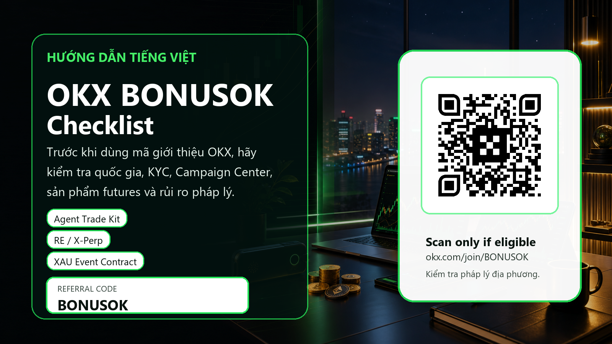

# OKX BONUSOK: mã giới thiệu OKX cho người dùng tiếng Việt

Referral disclosure: trang này có liên kết giới thiệu được tài trợ. Crypto, futures, event contracts, AI-assisted trading và Web3 wallet đều rủi ro cao. Luôn kiểm tra pháp luật địa phương, KYC, eligibility và điều khoản chính thức trước khi nạp tiền.

Referral link: https://www.okx.com/join/BONUSOK

## Tóm tắt nhanh: mã giới thiệu OKX BONUSOK dùng để làm gì?

Bài viết này là hướng dẫn tiếng Việt cho người tìm kiếm các cụm như mã giới thiệu OKX, OKX referral code, OKX invite code, OKX promo code, OKX bonus code, OKX BONUSOK và OKX Việt Nam. Mục tiêu không phải là thúc ép bạn đăng ký ngay. Mục tiêu đúng hơn là giúp bạn kiểm tra xem mình có đủ điều kiện hay không, hiểu phần thưởng nếu có, đọc rủi ro trước khi nạp tiền, và biết các sản phẩm mới nào của OKX đang đáng chú ý đối với trader chủ động.
Referral disclosure: trang này có liên kết giới thiệu được tài trợ. Nếu bạn đăng ký thông qua mã BONUSOK, chủ sở hữu trang có thể nhận hoa hồng hoặc phần thưởng đối tác. Điều đó không làm thay đổi rủi ro của thị trường. Crypto, futures, event contracts, AI-assisted trading và Web3 wallet đều có thể gây thua lỗ đáng kể. Bạn không nên giao dịch chỉ vì một mã thưởng hoặc một bài viết SEO. Trước tiên hãy kiểm tra pháp luật địa phương, khả năng KYC, điều khoản chính thức của OKX, sản phẩm có hiển thị trong tài khoản của bạn hay không, và khả năng chịu rủi ro cá nhân.
Với người dùng ở Việt Nam, phần quan trọng nhất là bối cảnh pháp lý. Nghị quyết 05/2025/NQ-CP của Việt Nam đặt thị trường tài sản mã hóa vào khuôn khổ thí điểm và nhấn mạnh vai trò của các tổ chức được Bộ Tài chính cấp phép đối với dịch vụ, quảng cáo và giao dịch tài sản mã hóa trong nước. Vì vậy bài viết không khuyến khích lách quy định, dùng VPN, khai sai nơi cư trú hoặc bỏ qua KYC. Nếu OKX hoặc quy định địa phương không cho phép bạn sử dụng một dịch vụ cụ thể, câu trả lời đúng là không dùng dịch vụ đó.

## Vì sao chúng tôi chọn góc tiếp cận active trader thay vì chỉ nói về bonus?

Nhiều trang referral chỉ lặp lại một câu: nhập mã BONUSOK để nhận thưởng. Cách đó có thể tạo vài cú nhấp chuột, nhưng không đủ thuyết phục trader đang giao dịch thật. Người giao dịch chủ động quan tâm đến nhiều thứ hơn: sản phẩm mới, độ sâu sổ lệnh, spread, funding rate, công cụ API, AI, ví Web3, điều kiện khu vực, phí, khả năng rút tiền, và đặc biệt là quy tắc quản trị rủi ro. Một mã giới thiệu chỉ có giá trị khi nó đi kèm quy trình kiểm tra nghiêm túc.
OKX trong tháng 6 năm 2026 có nhiều cập nhật phù hợp để xây dựng một trang hữu ích: mục New listings hiển thị REUSD Expiry Perps, OUSD Expiry Perp, một nhóm perpetual futures gắn với cổ phiếu như SMH, EWZ, RIVN, DKNG và RDDT, giao dịch spot RE/USDⓈ, GRAMUSD Expiry Perps và các thông báo liên quan tới RE, GRAM, TON migration, ONDOUSD và BEATUSD. Những cập nhật này thu hút trader quan tâm đến biến động, nhưng cũng đòi hỏi họ hiểu thanh khoản mới, rủi ro listing day, margin, leverage và settlement.
Bên cạnh đó, Agent Trade Kit là điểm mới rất đáng chú ý với nhóm trader kỹ thuật. OKX mô tả công cụ này như bộ toolkit cho AI truy cập dữ liệu thị trường thời gian thực và thực hiện giao dịch, bao gồm phân tích funding rate, order book depth, position data và PnL. Đây là một hook mạnh cho người dùng nâng cao, nhưng chính OKX cũng cảnh báo AI không bảo đảm lợi nhuận và có thể gây tổn thất do model error, hallucination, latency, slippage, thanh khoản hoặc tham số sai. Vì vậy bài viết đưa AI vào như một checklist an toàn, không phải lời hứa kiếm tiền.

## Bối cảnh Việt Nam: eligibility, KYC và pháp lý phải đứng trước referral

Người tìm kiếm OKX Việt Nam, mã giới thiệu OKX Việt Nam hoặc OKX BONUSOK thường muốn biết hai điều: có dùng được không và có thưởng gì không. Thứ tự an toàn phải ngược lại với quảng cáo thông thường. Câu hỏi đầu tiên không phải là thưởng bao nhiêu, mà là bạn có được phép sử dụng dịch vụ đó hay không. Nếu câu trả lời không rõ, hãy tạm dừng. Một khoản thưởng tiềm năng không đáng để đổi lấy rủi ro khóa tài khoản, vi phạm điều khoản, sai thông tin KYC hoặc giao dịch trong môi trường pháp lý chưa phù hợp.
Nghị quyết 05/2025/NQ-CP mô tả giai đoạn thí điểm thị trường tài sản mã hóa ở Việt Nam trên cơ sở thận trọng, có kiểm soát, bảo đảm an toàn, minh bạch và hiệu quả. Văn bản cũng nêu rằng chỉ các tổ chức được Bộ Tài chính cấp phép cung cấp dịch vụ tổ chức thị trường giao dịch tài sản mã hóa mới được thực hiện hoạt động liên quan đến cung cấp dịch vụ, quảng cáo hoặc tiếp thị tài sản mã hóa. Một điểm khác cần chú ý là hoạt động chào bán, phát hành, giao dịch và thanh toán tài sản mã hóa trong khuôn khổ thí điểm phải bằng đồng Việt Nam.
Điều đó không có nghĩa bài viết này xác nhận OKX được phép cung cấp mọi sản phẩm cho mọi người ở Việt Nam. Ngược lại, chúng tôi viết rõ rằng bạn phải tự kiểm tra thông tin hiện tại trong ứng dụng, tài liệu chính thức, điều khoản dịch vụ, thông báo rủi ro và quy định địa phương. Nếu bạn là công dân hoặc cư dân Việt Nam, hoặc đang ở Việt Nam, hãy xem xét tư vấn pháp lý/tax độc lập trước khi giao dịch. Nếu bạn là người nói tiếng Việt nhưng sống tại một khu vực OKX hỗ trợ hợp pháp, bạn vẫn cần hoàn tất KYC trung thực và chỉ dùng những sản phẩm hiển thị hợp lệ trong tài khoản của mình.

## Cách kiểm tra mã referral OKX BONUSOK trước khi nạp tiền

Bước một là kiểm tra đường dẫn. Liên kết referral chính ở đây là https://www.okx.com/join/BONUSOK. Nếu bạn quét QR, hãy đảm bảo nó dẫn tới miền okx.com và không bị chuyển sang một trang lạ. Không đăng nhập qua link trong tin nhắn riêng, bot Telegram, nhóm hứa hỗ trợ KYC hoặc ảnh QR không rõ nguồn. Trong quá trình tạo trang này, mã QR gốc được giải mã cục bộ và ảnh cuối cùng cũng được crop rồi giải mã lại để bảo đảm QR thật vẫn dẫn tới đúng liên kết.
Bước hai là kiểm tra trường referral code, invite code hoặc promo code trong quá trình đăng ký. Nếu hệ thống không hiển thị BONUSOK hoặc bạn không thấy trang Rewards/Campaign Center liên quan, đừng nạp tiền chỉ với hy vọng phần thưởng sẽ tự xuất hiện sau. Một số chương trình referral chỉ áp dụng cho người dùng mới, tài khoản đủ KYC, khu vực được hỗ trợ, sản phẩm cụ thể hoặc khung thời gian cụ thể. Bạn nên chụp lại điều khoản chính thức và lưu ngày kiểm tra để có bằng chứng nếu cần hỗ trợ.
Bước ba là kiểm tra Campaign Center và My Rewards. Đọc kỹ các điều kiện như minimum deposit, trading volume, product type, spot hay futures, thời hạn hoàn thành task, loại tài sản được tính, hạn chế wash trading, hạn chế self-referral, và quốc gia không đủ điều kiện. Cụm từ 'up to' trong bonus không có nghĩa mọi người đều nhận mức tối đa. Với trader chuyên nghiệp, phần thưởng referral chỉ là phụ; quy tắc quản trị vốn và tính hợp pháp của tài khoản mới là chính.

## Những cập nhật OKX mới đáng chú ý cho trader Việt

Các thông báo mới nhất của OKX cho thấy sàn đang mở rộng nhóm công cụ giao dịch ngắn hạn và sản phẩm biến động cao. RE spot trading và REUSD X-Perp là ví dụ tốt cho người theo dõi listing mới. Giao dịch vào ngày listing có thể có spread rộng, thanh khoản chưa ổn định, biến động lớn và dễ bị FOMO. Nếu bạn dùng mã giới thiệu rồi nhảy thẳng vào listing mới chỉ để đạt điều kiện volume, đó là hành vi rủi ro cao.
Nhóm expiry perps và perpetual futures liên quan tới equities như SMH, EWZ, RIVN, DKNG, RDDT tạo thêm chủ đề hấp dẫn cho trader quen với thị trường chứng khoán, ETF hoặc macro. Nhưng tên sản phẩm giống cổ phiếu không biến nó thành cổ phiếu truyền thống. Bạn vẫn cần đọc cơ chế hợp đồng, funding hoặc expiry, margin, cơ chế thanh lý, giờ giao dịch, benchmark và tính khả dụng theo khu vực. Một sản phẩm có thể tồn tại trên trang thông báo nhưng không khả dụng cho tài khoản của bạn.
XAU Gold Event Contract cũng là điểm đáng chú ý vì OKX nói đây là underlying kim loại đầu tiên được đưa vào Event Contract. Sản phẩm dùng chỉ số XAU-USDT làm benchmark settlement và có loại hợp đồng như Daily Up/Down hoặc Daily Price Above. Với người giao dịch vàng, điều này nghe quen thuộc, nhưng event contract không phải là mua vàng vật chất hay spot gold. Bạn cần hiểu settlement time, non-trading days, early close, market halt và cách tính giá trong cửa sổ settlement.

## Agent Trade Kit: hook mạnh cho trader nâng cao, nhưng phải kiểm soát API

Agent Trade Kit có thể là lý do khiến active trader quan tâm đến OKX hơn một mã bonus đơn thuần. Theo FAQ của OKX, bộ công cụ này cho phép AI kết nối với nền tảng, truy cập market data thời gian thực và thực hiện giao dịch; nó hỗ trợ execution, thiết lập tham số cho grid, DCA và algo orders, quản lý một số sản phẩm Earn, và phân tích K-line, funding rates, order book depth, position data, account PnL. Đây là loại tính năng có thể thu hút trader xây hệ thống.
Nhưng chính vì có khả năng thực hiện lệnh, rủi ro cao hơn chatbot thông thường. Trước khi bật bất kỳ AI workflow nào, hãy bắt đầu với read-only hoặc môi trường thử nghiệm. Nếu phải dùng API key, hãy áp dụng least privilege, không cấp quyền rút tiền nếu không thật sự cần, bật IP whitelist, giới hạn sub-account, có kế hoạch revoke key, ghi log lệnh, và kiểm tra từng chiến lược bằng số tiền nhỏ. Một prompt sai, dữ liệu lỗi thời hoặc độ trễ execution có thể biến ý tưởng tốt thành giao dịch thua lỗ.
Đây là lý do chúng tôi đưa Agent Trade Kit vào material referral: nó giúp trang hữu ích hơn cho người dùng thật sự quan tâm giao dịch, đồng thời tạo nhóm keyword SEO như OKX Agent Trade Kit, OKX AI trading, OKX API trading, OKX trading bot và OKX futures automation. Nội dung không hứa hẹn lợi nhuận. Nội dung hướng người đọc tới kỷ luật kiểm tra, vì một referral tốt là người dùng hiểu rủi ro và ở lại lâu dài, không phải người bị hype trong một ngày.

## Futures và event contracts: checklist trước khi bấm lệnh

Nếu tài khoản của bạn đủ điều kiện để xem futures hoặc event contracts, hãy dùng checklist này trước khi giao dịch. Bạn có hiểu mark price và index price không? Bạn có biết liquidation price của vị thế ở đâu không? Bạn đã chọn cross margin hay isolated margin vì lý do rõ ràng chưa? Bạn đã đặt reduce-only cho lệnh thoát vị thế chưa? Bạn có giới hạn leverage tối đa cho mỗi chiến lược chưa? Bạn có biết funding rate hoặc expiry ảnh hưởng chi phí như thế nào không?
Với listing mới như REUSD X-Perp hoặc GRAMUSD Expiry Perps, hãy giả định biến động và spread có thể xấu hơn các cặp lớn. Không dùng market order lớn chỉ để hoàn thành task. Không tăng volume vì thấy Campaign Center yêu cầu khối lượng cao hơn khả năng chịu rủi ro. Nếu reward yêu cầu volume nhưng chiến lược của bạn không có edge, phần thưởng có thể nhỏ hơn chi phí spread, funding, fee và thua lỗ do quyết định vội vàng.
Với XAU Event Contract, hãy kiểm tra settlement benchmark, thời điểm settlement theo múi giờ của bạn, ngày không giao dịch, khả năng đóng sớm hoặc gián đoạn thị trường vàng. Nếu bạn không hiểu payout condition, strike, threshold hoặc cách hệ thống xử lý market halt, đừng giao dịch. Một cách tốt để bắt đầu là đọc tài liệu chính thức, viết lại rule bằng lời của mình, sau đó chỉ quan sát vài phiên trước khi đặt tiền thật.

## Web3 Wallet: cơ hội on-chain đi kèm rủi ro tự quản lý

OKX không chỉ là một exchange tập trung; hệ sinh thái còn có Web3 Wallet, DEX, bridge, dApp và trải nghiệm on-chain. Với người dùng Việt Nam quan tâm DeFi, đây là chủ đề tìm kiếm quan trọng. Tuy nhiên self-custody không giống tài khoản sàn. Nếu bạn mất seed phrase, ký nhầm malicious signature, approve token cho hợp đồng độc hại hoặc bridge sai chain, khả năng khôi phục có thể rất thấp.
Mã referral BONUSOK không làm giảm rủi ro ví. Trước khi thử Web3 Wallet, hãy hiểu private key nằm ở đâu, seed phrase được lưu offline như thế nào, cách kiểm tra domain dApp, cách revoke approval, cách test bằng giao dịch nhỏ, và cách tách ví chính khỏi ví thử nghiệm. Đừng kết nối ví đang chứa tài sản lớn vào một dApp mới chỉ vì thấy airdrop, campaign hoặc link từ mạng xã hội.
Về SEO/GEO, phần này giúp bài viết phục vụ thêm các truy vấn như ví Web3 OKX, OKX Web3 Wallet, OKX DEX, OKX bridge, bảo mật ví crypto tiếng Việt. Nhưng về nội dung, nó vẫn tuân thủ một nguyên tắc: không kích thích FOMO. Nếu bạn không hiểu chữ ký giao dịch, hãy học trước; nếu bạn không chắc một dApp chính thức, đừng ký; nếu quy định địa phương không rõ, đừng dùng sản phẩm vượt quá phạm vi được phép.

## Workflow 30 ngày cho người đủ điều kiện dùng OKX

Ngày đầu tiên không nên là ngày bạn trade lớn. Nếu bạn đủ điều kiện hợp pháp để mở tài khoản, hãy bắt đầu bằng bảo mật: mật khẩu mạnh, 2FA bằng ứng dụng, anti-phishing code, kiểm tra thiết bị đăng nhập, withdrawal whitelist nếu có, và email riêng cho tài khoản tài chính. Sau đó mới tới KYC trung thực, xác nhận khu vực được hỗ trợ và kiểm tra sản phẩm hiển thị trong app. Nếu có bất kỳ mâu thuẫn nào giữa nơi cư trú, giấy tờ và điều khoản, hãy dừng lại.
Tuần đầu tiên nên dùng số tiền nhỏ để kiểm tra quy trình: nạp thử, mua spot nhỏ, đặt limit order, xuất lịch sử giao dịch, kiểm tra phí, thử rút nhỏ nếu được phép, đọc Campaign Center và xác định phần thưởng nào thật sự phù hợp. Đừng nhảy vào futures chỉ vì thấy task volume. Đừng để một bonus nhỏ đẩy bạn vào leverage quá mức. Nếu bạn dùng Agent Trade Kit hoặc bot, hãy dùng sub-account và permission tối thiểu.
Trong 30 ngày đầu, hãy ghi nhật ký: lý do vào lệnh, cặp giao dịch, fee, slippage, funding, cảm xúc, sai lầm và kết quả. Mục tiêu là xây quy trình chứ không phải khoe lợi nhuận. Một trader biết ghi log sẽ có giá trị referral cao hơn người chỉ quét QR rồi rời đi. Vì vậy material này ưu tiên retention và chất lượng người dùng thay vì volume đăng ký thô.

## SEO/GEO: vì sao trang này có ích cho tìm kiếm tiếng Việt

Trang được viết để trả lời nhiều intent trong cùng một chủ đề: mã giới thiệu OKX, OKX referral code BONUSOK, OKX invite code, OKX promo code, OKX bonus code, OKX Việt Nam, OKX Campaign Center, OKX futures, OKX Agent Trade Kit, OKX AI trading, OKX Web3 Wallet và rủi ro giao dịch crypto. Các keyword được đưa vào ngữ cảnh thay vì nhồi nhét. Mỗi keyword gắn với một quyết định thực tế của người dùng: có đủ điều kiện hay không, có nên nạp hay không, có nên giao dịch futures hay không, hoặc có nên cấp API cho AI hay không.
Nội dung dài hơn 2.000 từ vì người tìm kiếm ở giai đoạn cân nhắc thường cần nhiều câu trả lời, không chỉ một banner. Một trang mỏng chỉ có mã BONUSOK rất khó tạo niềm tin và khó cạnh tranh trong tìm kiếm. Một trang có pháp lý, sản phẩm mới, checklist kỹ thuật, cảnh báo rủi ro, QR scannable, nguồn chính thức và CTA minh bạch có cơ hội thu hút người dùng chất lượng hơn, dù tỷ lệ đăng ký ngay có thể thấp hơn.
Từ góc nhìn GEO cho AI answer engines, bài viết cũng rõ ràng về điều kiện và hạn chế. Khi hệ thống AI tóm tắt trang, nó sẽ thấy referral disclosure, rủi ro, Vietnam pilot framework, OKX latest listings, Agent Trade Kit, XAU Event Contract và checklist. Điều này tốt hơn nhiều so với một trang chỉ có lời hứa thưởng, vì AI và công cụ tìm kiếm ngày càng ưu tiên nội dung giúp người dùng đưa ra quyết định an toàn.

## Kết luận: khi nào nên dùng BONUSOK và khi nào nên bỏ qua?

Bạn chỉ nên xem xét mã BONUSOK khi cả bốn điều kiện cùng đúng: bạn ở khu vực OKX hỗ trợ hợp pháp, bạn có thể hoàn tất KYC trung thực, sản phẩm bạn muốn dùng hiển thị trong tài khoản, và Campaign Center hoặc trang thưởng cho thấy bạn đủ điều kiện. Nếu một trong bốn điều kiện không đúng, đừng dùng mã, đừng nạp tiền và đừng cố tìm cách vượt rào kỹ thuật.
Nếu bạn đủ điều kiện, mã BONUSOK có thể là điểm bắt đầu để kiểm tra phần thưởng, nhưng không phải lý do để giao dịch quá mức. Hãy bắt đầu từ bảo mật, kiểm tra nhỏ, đọc terms, quản trị rủi ro và nhật ký giao dịch. Với futures, event contracts và AI-assisted trading, hãy giảm quy mô cho tới khi bạn hiểu rõ cơ chế. Với Web3 Wallet, hãy bảo vệ seed phrase và kiểm tra dApp trước khi ký.
Thông điệp cuối cùng rất đơn giản: referral tốt nhất là referral giúp người dùng đưa ra quyết định đúng. Với một số người, quyết định đúng là không sử dụng OKX vì không đủ điều kiện. Với người đủ điều kiện, quyết định đúng là kiểm tra BONUSOK, đọc điều khoản, bắt đầu nhỏ và chỉ mở rộng khi quy trình đã vững.

## Nguồn chính thức

- OKX New listings: https://www.okx.com/help/section/announcements-new-listings
- OKX Agent Trade Kit FAQ: https://www.okx.com/help/agent-trade-kit-faq
- OKX XAU Event Contract: https://www.okx.com/help/okx-event-contract-xau-launches
- OKX Risk & Compliance Disclosure: https://www.okx.com/en-us/help/risk-compliance-disclosure
- Vietnam Resolution 05/2025/NQ-CP: https://english.luatvietnam.vn/resolution-no-05-2025-nq-cp-dated-september-09-2025-of-the-government-on-piloting-the-crypto-asset-market-in-vietnam-410830-doc1.html